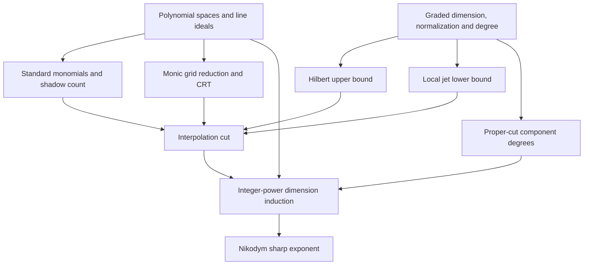

# Lean blueprint: sharp finite-field Nikodym exponent

**Planning document; no Lean formalization has been started.** The statements below are proposed obligations, not compiled declarations. No theorem is being treated as an imported fact merely because it appears in the informal manuscript.

Source proof: `nikodym_sharp_power_saving.tex`, the five-page finite-grid interpolation argument supplied in this conversation. Mathlib source audit: **5 September 2026**, revision `7974e751bece493b6ff508039423ca9fa2452fa8`. The coding agent should pin a revision and recheck interfaces before implementation; this document has not been tested against a Lean compiler.

## 1. Recommended architecture

Use **affine polynomial ideals at the public interface**, and **homogeneous ideals only inside the dimension/degree backend**. The three public algebraic theorems are:

\[
H_I(t)\le\Delta\binom{t+k}{k},\qquad
j_{I,x}(r)\ge\binom{r+k-1}{k},\qquad
\sum_i\deg I_i\le (\deg g)\Delta.
\]

The last theorem must also return the correct component dimensions and the prime-containment property used to assign lines. These are substantial pieces of commutative algebra, not one-line wrappers around the currently available mathlib modules.

The main proof should manipulate only finite-dimensional submodules, quotient algebra maps, finite families of ideals, and natural-number inequalities. It needs no schemes, `Proj`, intersection cycles, smoothness, or completions. Some local algebra and localization remain inside the proofs of the three public theorems.

**Do not encode these theorems as unproved fields of a carrier structure and then call the final result unconditional.** It is useful to develop the finite-grid argument conditionally against this interface, but the final theorem must instantiate the interface with proved facts about actual polynomial ideals.

### Common conventions

- F is a finite field, q its cardinality, K an algebraically closed field containing F via an injective field map iota. The public theorem may take `K = AlgebraicClosure F`. Keep most polynomial lemmas general over a field; use infinitude only where required.
- Write $P_d=K[X_1,\ldots,X_d]$. In Lean the intended underlying type is `MvPolynomial (Fin d) K`.
- Use `MvPolynomial.restrictTotalDegree` for $P_{d,\le t}$.
- For an ideal I, set $V_I(t)=\operatorname{im}(P_{d,\le t}\to P_d/I)$ and $H_I(t)=\dim_K V_I(t)$. Take finrank of this finite-dimensional image, not of the full coordinate ring.
- Define $\mathfrak m_x=\ker(\operatorname{ev}_x)$ and $Q_{I,x}(r)=P_d/(I+\mathfrak m_x^r)$. In ideal notation, the plus sign is ideal supremum. Prove finite dimensionality before using finrank.
- In the algebra backend, standard graded means an N-graded algebra with degree-zero part K, generated by its degree-one part.
- A carrier is a **proper prime ideal** I, with $k=\dim(P_d/I)$ and $\Delta=\deg I>0$. Degree comes from its homogenized Hilbert polynomial; it is not supplied by an arbitrary chosen defining system.
- Use finite indexed line families with anchors b and nonzero directions v. A line lies on I if substitution $X_i\mapsto b_i+v_iT$ annihilates I as a polynomial identity. This avoids a quotient type of geometric lines.
- Coordinates of finite-grid points and lines remain in F. Ideals and cut polynomials may have arbitrary coefficients in K. No Frobenius-stability hypothesis is allowed on the carriers.
- Cardinalities, dimensions, degrees, multiplicities r, and the core inequalities live in natural numbers. Hilbert polynomials live over Q; this causes no restriction on the characteristic of K.

### Core target

Set $C=8d^2+1$ and $m_k=2^{k-1}$. Formalize the carrier theorem in the form

\[
\boxed{L^{m_k}q\le(C\Delta)^{m_k}q^{k m_k}.}
\]

For the whole ambient space, this becomes

\[
|F^d\setminus N|^{2^{d-1}}q
\le C^{2^{d-1}}q^{d2^{d-1}}.
\]

Only the final presentation corollary converts this to the real exponent $d-2^{1-d}$. This formulation avoids a substantial amount of coercion and real-power bookkeeping in the induction.

## 2. Changes to the informal proof that make formalization easier

### Replace local-ring jets by global quotients

Use $Q_{I,x}(r)$ directly. The equivalence with the local quotient is needed only inside the local jet lower-bound package. Grid interpolation and line restriction should never have localizations in their theorem statements.

### Use a standard-monomial basis, not a Groebner-basis algorithm

A degree-compatible monomial order, leading-term cancellation, and well-founded induction give the basis needed for normalized Hilbert monotonicity. No effective computation of a finite basis of an ideal is needed. The weighted shadow count takes place in natural numbers. Replacing it with differentiation over K would create a false characteristic issue.

### Prove only the grid containment actually used

Choose monic coordinate polynomials

\[
g_i(T)=\prod_{a\in F}(T-\iota(a)),\qquad
Z_i=g_i(X_i),\qquad J=(Z_1,\ldots,Z_d).
\]

The proof needs bounded reduction modulo $J^r$ and the containments $J^r\subseteq\mathfrak m_x^r$. CRT supplies an arbitrary representative of the requested ambient jets; bounded reduction replaces it by one of degree

\[
U=q(r-1)+d(q-1)
\]

without changing any jet. Neither $J=\bigcap_x\mathfrak m_x$ nor $J^r=\bigcap_x\mathfrak m_x^r$ is required in the core DAG. Defining g_i by its product also avoids proving a Frobenius-polynomial identity.

### Replace the norm proof's formal branches by one free fiber

For the Hilbert upper bound, choose a finite linear homogeneous normalization

\[
S=K[Y_0,\ldots,Y_k]\subseteq R,
\qquad [\operatorname{Frac}R:\operatorname{Frac}S]=\Delta.
\]

The graded-chart lemma A09 identifies localization in $Y_0$ with a Laurent polynomial extension of the degree-zero chart. It proves that generic rank and norms pass to this chart. After dehomogenization, write $B=K[y_1,\ldots,y_k]\subseteq A$. Invert a nonzero h so that $A_h$ is free of rank Delta over $B_h$, and choose a point a with $h(a)\ne0$. With $\mathfrak n=(y-a)$, the map

\[
R_t\longrightarrow A_h/\mathfrak n^{t+1}A_h,\qquad f\longmapsto f/Y_0^t
\]

has target dimension $\Delta\binom{t+k}{k}$. If f is in its kernel, the matrix of multiplication by f has every entry in $\mathfrak n^{t+1}B_h$, so its determinant lies in $\mathfrak n^{\Delta(t+1)}B_h$. The homogeneous norm-degree lemma says this determinant is a polynomial of degree at most Delta times t. Because h(a) is nonzero, localization does not change membership in these powers at a. The determinant must therefore be zero, forcing f=0.

This proves injectivity **without requiring a separable normalization, reduced fiber, etale algebra, completed local ring, or branch expansion**. The norm-degree, generic-rank-equals-degree, and graded-chart norm-compatibility lemmas remain explicit major obligations. The coordinate $Y_0$ can differ from the original chart coordinate $X_0$; the finite grid is never moved by this auxiliary construction. A finite module must first be localized before it is asserted to be free.

### Reuse height theory for the local jet minimum

Construct the associated graded algebra at a closed point and linearly normalize it using s degree-one parameters. Lift these parameters to the local ring. The quotient of the associated graded algebra by them is finite-dimensional; Nakayama then shows their lifts generate a maximal-ideal-primary ideal. The height theorem gives $k\le s$. Monomials in k of the independent linear parameters supply the required jet lower bound.

This route reuses the height and linear-normalization packages needed elsewhere. It avoids requiring a separate general theorem about the dimension of an extended Rees algebra. The associated graded construction and its finite-generation/jet bridge still need real work.

### Keep the degree proof graded

For a proper homogeneous cut, use the exact sequence

\[
0\longrightarrow R(-e)\xrightarrow{\cdot G}R
\longrightarrow R/(G)\longrightarrow0.
\]

Then use Hilbert-polynomial additivity and a homogeneous prime filtration. This handles nonreduced sections and bounds the **sum** of reduced component degrees. It is safer than silently treating arbitrary affine filtered exact sequences as strict. Translate the resulting theorem to affine ideals once, discarding components at infinity.

## 3. Overview DAG

The standalone `.mmd` and `.json` files contain the full statement-level DAG. This diagram groups related statements.

## 4. Statement catalog

IDs are stable blueprint labels. Module paths are **suggested future modules**, not existing files. Difficulty describes expected infrastructure burden, not a time estimate. Every node is currently **planned, not formalized**. Each node records its direct dependencies; the JSON gives a topological order as well.

### F01 — Degree-bounded polynomial spaces

**Suggested module:** `Nikodym.PolynomialSpaces`. **Burden:** routine. **Depends on:** common conventions / mathlib foundations.

**Statement.** For a field $K$, let $P_d=K[X_1,\ldots,X_d]$ and $P_{d,\le t}=\{f:\deg f\le t\}$. This is a finite-dimensional $K$-submodule, with $\dim_K P_{d,\le t}=\binom{t+d}{d}$. Multiplication by a degree-at-most-$e$ polynomial sends $P_{d,\le t}$ into $P_{d,\le t+e}$.

**Proof route.** Use MvPolynomial.restrictTotalDegree and its monomial basis. Separate monomial counting from the polynomial statements; retain the zero polynomial in every degree space.

### F02 — Affine restriction spaces and Hilbert function

**Suggested module:** `Nikodym.Hilbert.Defs`. **Burden:** routine. **Depends on:** F01.

**Statement.** For any ideal $I\subseteq P_d$, define $V_I(t)=\operatorname{im}(P_{d,\le t}\to P_d/I)$ and $H_I(t)=\dim_K V_I(t)$. Prove finite dimensionality, monotonicity in $t$, and $H_{(0)}(t)=\binom{t+d}{d}$. A nonzero element of $V_I(t)$ has a representative $f\in P_{d,\le t}\setminus I$.

**Proof route.** Use the image submodule of the quotient algebra map restricted to the bounded-degree submodule. The entire coordinate ring need not be finite-dimensional.

### F03 — Point ideals and finite jet quotients

**Suggested module:** `Nikodym.Jets.Defs`. **Burden:** medium. **Depends on:** F01.

**Statement.** For $x\in K^d$, set $\mathfrak m_x=\ker(\operatorname{ev}_x)$ and $Q_{I,x}(r)=P_d/(I+\mathfrak m_x^r)$, for $r\ge1$. These are finite-dimensional; write $j_{I,x}(r)=\dim_K Q_{I,x}(r)$. Translation identifies $P_d/\mathfrak m_x^r$ with the span of monomials of degree $<r$, so its dimension is $\binom{r+d-1}{d}$. If $I\not\subseteq\mathfrak m_x$, then $Q_{I,x}(r)=0$.

**Proof route.** Translate to the origin and use idealOfVars and its power-membership API. For the last assertion, an element of I with nonzero value at x becomes a unit modulo the nilpotent ideal m_x/m_x^r. Do not introduce localizations in this public interface.

### F04 — Parametrized lines and their prime ideals

**Suggested module:** `Nikodym.Lines`. **Burden:** medium. **Depends on:** F01, F02.

**Statement.** For $b,v\in F^d$, $v\ne0$, define $\operatorname{res}_{b,v}:P_d\to K[T]$ by $X_i\mapsto\iota(b_i)+\iota(v_i)T$. It is a surjective $K$-algebra homomorphism, its kernel $\lambda_{b,v}$ is prime, and $P_d/\lambda_{b,v}\cong K[T]$. Also $\deg(\operatorname{res}_{b,v}f)\le\deg f$ and $H_{\lambda_{b,v}}(t)=t+1$. Define line containment in $I$ by $I\subseteq\lambda_{b,v}$.

**Proof route.** Choose a nonzero coordinate of v to construct a preimage of T. Containment means polynomial identity on the extended K-line, not merely zero evaluation at its q finite-field points.

### F05 — Private families indexed by their anchors

**Suggested module:** `Nikodym.PrivateFamily`. **Burden:** routine. **Depends on:** F04.

**Statement.** A private family is a finite index type $E$ with $b,v:E\to F^d$, each $v_e\ne0$, such that $b_f=b_e+t v_e$ implies $f=e$ for every $e,f\in E$ and $t\in F$. Prove b is injective, distinct indices give distinct line ideals, and every subfamily is private. Put $L=|E|$ and $B_0=b(E)$. Each selected line has exactly its own anchor in $B_0$.

**Proof route.** Use an indexed family instead of a quotient type of affine lines. This makes component assignment and the q-1 nonprivate parameters straightforward.

### H01 — Standard monomials preserve the degree filtration

**Suggested module:** `Nikodym.Hilbert.StandardMonomials`. **Burden:** medium. **Depends on:** F01, F02.

**Statement.** Choose a total-degree-compatible monomial order. For every ideal I, there is a divisor-closed set $S_I\subseteq\mathbb N^d$ of standard exponents such that the classes $X^\alpha$, $\alpha\in S_I$, form a basis of $P_d/I$, and those with $|\alpha|\le t$ form a basis of $V_I(t)$. In particular $H_I(t)=|\{\alpha\in S_I:|\alpha|\le t\}|$.

**Proof route.** Prove spanning by leading-term cancellation and well-founded induction; prove independence by inspecting a leading term of a relation. Existing MonomialOrder.div_set can divide noncomputably by all nonzero elements of I. No Buchberger algorithm or finite executable Groebner basis is needed.

### H02 — Weighted shadow inequality

**Suggested module:** `Nikodym.Hilbert.Shadow`. **Burden:** medium. **Depends on:** F01.

**Statement.** For a divisor-closed monomial set in d+1 variables, let h(t) count its degree-t monomials. Then $(t+1)h(t+1)\le(t+d+1)h(t)$. Give the edge $\alpha\to\alpha+e_i$ weight $\alpha_i+1$; count incoming and outgoing weights in $\mathbb N$.

**Proof route.** This is finite weighted double counting. The weights are natural numbers, never elements of K. In the affine application add a slack exponent t-|alpha| to the d standard exponents.

### H03 — Normalized cumulative Hilbert inequality

**Suggested module:** `Nikodym.Hilbert.Normalized`. **Burden:** medium. **Depends on:** F02, H01, H02.

**Statement.** For every ideal I and $t\le u$, $H_I(u)\binom{t+d}{d}\le H_I(t)\binom{u+d}{d}$. This is a natural-number inequality, with no divisions and no assumption that I is prime or homogeneous.

**Proof route.** Apply H02 to the slack-variable lift of S_I and iterate the adjacent-degree inequality. An explicit homogenization construction is unnecessary for this lemma.

### A01 — Finite-type dimension and closed-point height

**Suggested module:** `Nikodym.Algebra.Dimension`. **Burden:** substantial. **Depends on:** common conventions / mathlib foundations.

**Statement.** Develop the needed finite-type dimension bridges over an algebraically closed K: a K-rational maximal ideal of a finitely generated K-domain of dimension k has height k; strict inclusion of prime ideals strictly decreases quotient dimension; minimal primes over a nonzero nonunit principal ideal in such a domain have quotient dimension k-1. Minimal-prime sets in the Noetherian rings used here are finite, and any prime over an ideal contains a minimal prime over it.

**Proof route.** Reuse Krull dimension, minimal primes, and the height theorem. The finite-type dimension formula and height-to-quotient-dimension bridge must be proved explicitly; the principal ideal theorem alone is insufficient. Keep extended-natural dimension bookkeeping inside this module.

### A02 — Linear homogeneous Noether normalization

**Suggested module:** `Nikodym.Algebra.LinearNormalization`. **Burden:** substantial. **Depends on:** A01.

**Statement.** For a nonzero standard graded finitely generated K-algebra R, with K infinite and $\dim R=s$, there exist degree-one elements $y_1,\ldots,y_s$ that are algebraically independent and for which R is finite over $K[y_1,\ldots,y_s]$. Include the domain case and the nonreduced standard graded case needed for local jets.

**Proof route.** Use degree-one choices outside finite unions of relevant primes, or a homogeneous monic change-of-variables proof. Existing nonlinear Noether normalization does not imply the required degree control. Dimension theory supplies the number of parameters.

### A03 — Hilbert polynomials and graded additivity

**Suggested module:** `Nikodym.Algebra.HilbertPolynomial`. **Burden:** substantial. **Depends on:** F01.

**Statement.** For a finitely generated graded module over a polynomial ring, with finite-dimensional graded pieces, its Hilbert function eventually agrees with a polynomial in $\mathbb Q[t]$. In an exact degree-preserving sequence, Hilbert polynomials add; a shift by e replaces p(t) by p(t-e). Provide this at least for graded quotients and the subquotients in a homogeneous prime filtration.

**Proof route.** Build the graded-module Hilbert-Serre step and connect it to Polynomial.hilbertPoly. The coefficient ring of the Hilbert polynomial is Q even when K has positive characteristic. Eventual coefficient formulas already in mathlib are only one building block.

### A04 — Dimension, positive degree, and normalization rank

**Suggested module:** `Nikodym.Algebra.Degree`. **Burden:** substantial. **Depends on:** A01, A02, A03.

**Statement.** For a homogeneous prime P with $\dim(S/P)=k+1\ge1$, the eventual homogeneous Hilbert polynomial has degree k and leading coefficient $\Delta/k!$ for a positive integer $\Delta$. Under a finite linear normalization by k+1 variables, the fraction-field extension has degree $\Delta$. Establish the corresponding positivity and leading-coefficient comparison for the graded subquotients used in B02.

**Proof route.** Make degree a defined invariant, not an arbitrary number carrying the desired upper bound as an assumption. Compare Hilbert polynomials of finite graded modules over the normalizing polynomial ring; lower-dimensional torsion changes only lower coefficients.

### A05 — Affine and homogeneous ideal bridge

**Suggested module:** `Nikodym.Algebra.Homogenization`. **Burden:** substantial. **Depends on:** F02, A04.

**Statement.** For a proper prime $I\subseteq P_d$, its homogenized closure $I^h\subseteq K[X_0,\ldots,X_d]$ is homogeneous prime and $X_0\notin I^h$. Dehomogenization recovers I. The homogeneous degree-t quotient dimension equals $H_I(t)$; its projective dimension is $\dim(P_d/I)$ and its degree defines $\deg I$. Conversely retain only homogeneous primes avoiding $X_0$ when returning to affine carriers.

**Proof route.** Use homogeneous ideals without schemes or Proj. Homogenize the ideal, not just an arbitrary chosen generating list; any necessary X0-saturation belongs in this bridge. This is the only public affine-to-homogeneous conversion.

### A06 — A finite free fiber after localization

**Suggested module:** `Nikodym.Algebra.FreeFiber`. **Burden:** medium. **Depends on:** A02, A04, F03.

**Statement.** Let $B=K[y_1,\ldots,y_k]\subseteq A$ be the affine chart of a finite linear normalization of an integral graded algebra, of generic rank $\Delta$. There exist $h\in B\setminus\{0\}$ and $a\in K^k$ with $h(a)\ne0$ such that $A_h$ is free of rank $\Delta$ over $B_h$. For $\mathfrak n=(y_1-a_1,\ldots,y_k-a_k)$, $\dim_K A_h/\mathfrak n^{t+1}A_h=\Delta\binom{t+k}{k}$.

**Proof route.** Use finite presentation and generic freeness at the fraction field, then invert one denominator. An infinite field supplies a point where h is nonzero. Finite torsionfree is not the same as globally free.

### A07 — Polynomial norm with homogeneous degree control

**Suggested module:** `Nikodym.Algebra.GradedNorm`. **Burden:** substantial. **Depends on:** A02, A04.

**Statement.** Let $S=K[Y_0,\ldots,Y_k]\subseteq R$ be a finite linear normalization of a graded domain with fraction-field degree $\Delta$. For homogeneous $f\in R_t$, its field norm belongs to $S_{\Delta t}$ (zero included). It is nonzero whenever f is nonzero. The affine compatibility needed later is a separate obligation, A09.

**Proof route.** Integrality and normality of the polynomial ring make the norm polynomial. A homogeneous fraction-field basis, or compatibility with scaling, controls its degree. Prove this as a separate theorem: generic rank by itself does not control polynomial degrees.

### A08 — Uniform Hilbert upper bound

**Suggested module:** `Nikodym.Hilbert.DegreeUpper`. **Burden:** substantial. **Depends on:** A05, A06, A07, A09, F03.

**Statement.** For a proper prime I with $\dim(P_d/I)=k$ and $\deg I=\Delta$, for every $t\ge0$ one has $H_I(t)\le\Delta\binom{t+k}{k}$.

**Proof route.** Map the homogeneous degree-t space into the free fiber quotient from A06 by $f\mapsto f/Y_0^t$. Use A09 to identify the chart norm with the homogeneous norm after setting $Y_0=1$. If f maps to zero, every entry of its multiplication matrix lies in $\mathfrak n^{t+1}B_h$, so its determinant lies in $\mathfrak n^{\Delta(t+1)}B_h$. Since h(a) is nonzero, contract this membership to B. A07 and the order-versus-degree bound force the norm, and hence f, to be zero. This proves injectivity. No separability, reduced fibers, etale theory, completions, or Taylor branches are required.

### A09 — Graded chart and norm compatibility

**Suggested module:** `Nikodym.Algebra.GradedChart`. **Burden:** substantial. **Depends on:** A02, A04, A07.

**Statement.** For the finite linear normalization S inside R, put $A=(R[Y_0^{-1}])_0$ and $B=(S[Y_0^{-1}])_0$. Prove $R[Y_0^{-1}]\cong A[Y_0,Y_0^{-1}]$ and its S analogue. The algebra A is finite over B with the same generic rank $\Delta$. For homogeneous f of degree t, the homogeneous field norm after setting $Y_0=1$ equals the affine field norm of $f/Y_0^t$. In particular the latter is a polynomial of degree at most $\Delta t$.

**Proof route.** Use the direct-sum grading to identify localization in degree one with a Laurent polynomial extension of its degree-zero part. Use norm compatibility with a purely transcendental base extension. The chosen normalization coordinate Y0 need not be the original finite-grid chart coordinate X0; this construction is internal to the Hilbert upper-bound proof.

### J01 — Associated graded local algebra and parameters

**Suggested module:** `Nikodym.Algebra.LocalParameters`. **Burden:** substantial. **Depends on:** F03, A01, A02.

**Statement.** For $I\subseteq\mathfrak m_x$ prime, form the local quotient $(P_d/I)_{\mathfrak m_x/I}$ and its associated graded algebra. It is a finitely generated standard graded K-algebra. If a linear normalization of it has s independent degree-one parameters, their lifts generate a maximal-ideal-primary ideal in the local ring; consequently $s\ge\operatorname{ht}(\mathfrak m_x/I)=k$. Prove the dimension identity $j_{I,x}(r)=\sum_{n<r}\dim_K(\operatorname{gr}_{\mathfrak m}A)_n$, where A here denotes this local quotient. Do not claim a canonical algebra isomorphism with the graded direct sum.

**Proof route.** Use finite-dimensionality of the graded quotient by the parameters, then local Nakayama and the height theorem. This avoids needing a separate general Rees-algebra dimension theorem. An alternative implementation may instead prove associated-graded dimension equals local dimension, but that is not an extra requirement in the recommended route.

### J02 — Local jet minimum

**Suggested module:** `Nikodym.Jets.LowerBound`. **Burden:** medium. **Depends on:** J01, F03.

**Statement.** For a proper prime I of quotient dimension k, every K-rational point x with $I\subseteq\mathfrak m_x$, and every $r\ge1$, $j_{I,x}(r)\ge\binom{r+k-1}{k}$.

**Proof route.** Take k of the independent degree-one parameters from J01. Their monomials of degree below r remain linearly independent in the associated graded jet space. This statement is only for closed rational points; it does not quantify over arbitrary primes.

### B01 — Degree of a proper graded hypersurface section

**Suggested module:** `Nikodym.Algebra.HypersurfaceDegree`. **Burden:** substantial. **Depends on:** A01, A03, A04.

**Statement.** For an integral graded coordinate ring R of projective dimension $k\ge1$ and degree $\Delta$, and a nonzero homogeneous element G of degree $e\ge1$, the exact sequence $0\to R(-e)\xrightarrow{G}R\to R/(G)\to0$ gives $h_{R/(G)}(t)=h_R(t)-h_R(t-e)$ for $t\ge e$. Its top-dimensional degree is $e\Delta$, and its minimal components have projective dimension k-1.

**Proof route.** Multiplication is injective because R is a domain. The section quotient is allowed to be nonreduced and non-Cohen-Macaulay. Interpret projectively irrelevant zero-dimensional pieces through the Hilbert polynomial, not as extra projective components.

### B02 — Degree sum over reduced minimal components

**Suggested module:** `Nikodym.Algebra.ComponentDegree`. **Burden:** substantial. **Depends on:** A01, A03, A04, B01.

**Statement.** For the homogeneous section quotient in B01, let $P_i$ be its distinct minimal primes. Then $\sum_i\deg(S/P_i)\le e\Delta$. More generally, for a pure-dimensional homogeneous quotient of positive Krull dimension, the sum of the reduced minimal-component degrees is at most its degree. Every prime containing the section ideal contains one of the $P_i$.

**Proof route.** A finite homogeneous prime filtration and additivity of Hilbert polynomials suffice. Lower-dimensional factors do not affect the leading term; every minimal prime occurs with a positive coefficient. No intersection-cycle objects or full primary decomposition are needed.

### B03 — Affine proper-cut interface

**Suggested module:** `Nikodym.Algebra.ProperCut`. **Burden:** substantial. **Depends on:** A05, B02.

**Statement.** Let I be prime, $\dim(P_d/I)=k\ge2$, $\deg I=\Delta$, $g\notin I$, $\deg g\le T$, and $I+(g)\ne P_d$. There exist finitely many proper primes $I_i\supseteq I+(g)$, each of quotient dimension k-1 and positive degree $\Delta_i$, with $\sum_i\Delta_i\le T\Delta$. Every prime containing $I+(g)$ contains at least one $I_i$.

**Proof route.** Homogenize, apply B01-B02, and discard components at infinity. The affine finite-type dimension formula guarantees the remaining components have the stated dimension. The nonempty-section assumption matters: a polynomial not in I can be a unit modulo I.

### G01 — Bounded reduction modulo a grid-ideal power

**Suggested module:** `Nikodym.Grid.Reduction`. **Burden:** medium. **Depends on:** F01.

**Statement.** Let $g_i(T)$ be monic univariate polynomials of common degree $q\ge1$, put $Z_i=g_i(X_i)$ and $J=(Z_1,\ldots,Z_d)$. For every $r\ge1$, every class of $P_d/J^r$ has a representative of degree at most $U=q(r-1)+d(q-1)$. It suffices to span by $X^\alpha\prod_iZ_i^{\gamma_i}$ with $\alpha_i<q$ and $|\gamma|<r$.

**Proof route.** Use induction or repeated monic division in one coordinate at a time. Spanning is sufficient; do not spend effort proving this is a basis. For the finite grid choose g_i(T)=product over a in F of (T-iota(a)).

### G02 — CRT for the grid point powers

**Suggested module:** `Nikodym.Grid.CRT`. **Burden:** routine. **Depends on:** F03.

**Statement.** For distinct points $x,y\in\iota(F)^d$, the ideals $\mathfrak m_x$ and $\mathfrak m_y$ are comaximal; so are their positive powers. Hence the map $P_d\to\prod_{x\in F^d} P_d/\mathfrak m_{\iota(x)}^r$ is surjective. For the grid polynomials in G01, $J^r\subseteq\mathfrak m_{\iota(x)}^r$ for every x.

**Proof route.** A coordinate on which x and y differ proves comaximality. Reuse ideal-power and finite CRT theorems. Only the displayed containment is needed; proving J equals the intersection of all point ideals is optional and outside the core DAG.

### G03 — Joint grid jet interpolation on a quotient

**Suggested module:** `Nikodym.Grid.Jets`. **Burden:** medium. **Depends on:** F02, F03, G01, G02.

**Statement.** For any ideal I and $r\ge1$, with $U=q(r-1)+d(q-1)$, the restriction map $V_I(U)\to\prod_{x\in F^d}Q_{I,\iota(x)}(r)$ is surjective. Thus $\sum_{x\in F^d}j_{I,\iota(x)}(r)\le H_I(U)$.

**Proof route.** Use CRT to choose arbitrary ambient jet data, reduce its representative modulo J^r using G01, and retain the jets by G02. Quotient the target by I and factor through V_I(U). Use a finite product and finrank additivity, not an infinite direct sum.

### G04 — Omitting conditions leaves a nonzero restriction

**Suggested module:** `Nikodym.Grid.OmittedConditions`. **Burden:** routine. **Depends on:** F02, F03, G03.

**Statement.** Let $r\ge1$, $U=q(r-1)+d(q-1)$, $B_0\subseteq F^d$ finite, and $T\le U$. If $H_I(U)<H_I(T)+\sum_{b\in B_0}j_{I,\iota(b)}(r)$, there exists $g\in P_{d,\le T}\setminus I$ with $g\in I+\mathfrak m_{\iota(x)}^r$ for every $x\in F^d\setminus B_0$.

**Proof route.** Form the linear map from V_I(T) to the product of the remaining jet spaces. G03 and the strict dimension inequality make its kernel nonzero. This additive formulation avoids natural-number subtraction in all finrank comparisons.

### L01 — Jet vanishing restricts to divisibility on a line

**Suggested module:** `Nikodym.Lines.Jets`. **Burden:** routine. **Depends on:** F03, F04.

**Statement.** If $I\subseteq\lambda_{b,v}$, $x=b+av$ with $a\in F$, and $g\in I+\mathfrak m_{\iota(x)}^r$, then $(T-\iota(a))^r$ divides $\operatorname{res}_{b,v}g$ in K[T].

**Proof route.** Each generator X_i-iota(x_i) maps to iota(v_i)(T-iota(a)). Map the ideal and its power, and use that the I-part maps to zero.

### L02 — The q-1 roots force line identity

**Suggested module:** `Nikodym.Lines.Vanishing`. **Burden:** routine. **Depends on:** F04, L01.

**Statement.** If $f\in K[T]$, $\deg f<r(q-1)$, and $(T-\iota(a))^r\mid f$ for every $a\in F\setminus\{0\}$, then $f=0$. Therefore a degree-at-most-$r(q-1)-1$ polynomial satisfying the nonprivate jet conditions vanishes identically on the selected line.

**Proof route.** Use pairwise coprime linear factors, product divisibility, and the degree of a monic product. This route avoids rootMultiplicity conventions at the zero polynomial and needs no derivatives.

### C01 — Affine point count from grid jets

**Suggested module:** `Nikodym.Counting.Points`. **Burden:** medium. **Depends on:** F03, F05, G03, J02, A08.

**Statement.** For prime I of quotient dimension k and degree $\Delta$, the number of x in $F^d$ with $I\subseteq\mathfrak m_{\iota(x)}$ is at most $\Delta q^k$. In particular any private family on I has $L\le\Delta q^k$.

**Proof route.** For all r, bound the number of points times $\binom{r+k-1}{k}$ by $\Delta\binom{q(r-1)+d(q-1)+k}{k}$. Clear k! and compare leading coefficients of polynomials in r. A polynomial nonnegative at all sufficiently large natural inputs cannot have negative leading coefficient. No analytic limit is necessary.

### C02 — Integer binomial gap estimate

**Suggested module:** `Nikodym.Arithmetic.BinomialGap`. **Burden:** medium. **Depends on:** common conventions / mathlib foundations.

**Statement.** Assume $d\ge2$, $q\ge2$, and $8d^2\le r\le q$. Put $T=r(q-1)-1$, $U=q(r-1)+d(q-1)$. Then $T\le U$, $U-T\le dq$, and $r\binom{U+d}{d}\le(r+4d^2)\binom{T+d}{d}$. For $1\le k\le d$, also $\binom{T+k}{k}\le q^k\binom{r+k-1}{k}$.

**Proof route.** Temporarily work in Q with the product of $1+(U-T)/(T+i)$. Their increments sum to at most $2d^2/r\le1/4$. Prove the finite-product inequality $\prod_i(1+x_i)\le1+2\sum_i x_i$ when all x_i are nonnegative and their sum is at most 1/2, then clear denominators. No exponential function is needed.

### C03 — Hilbert gap with all denominators cleared

**Suggested module:** `Nikodym.Hilbert.Gap`. **Burden:** medium. **Depends on:** H03, A08, C02.

**Statement.** Assume $d\ge2$, $1\le k\le d$, C02, and a prime carrier of quotient dimension k and degree $\Delta$. With $M=\Delta q^k$ and $c=\binom{r+k-1}{k}$, one has $rH_I(U)\le rH_I(T)+4d^2 M c$.

**Proof route.** Combine normalized Hilbert monotonicity, the integer binomial-ratio estimate, and the degree upper bound. Keep the statement additive and over natural numbers; prove positivity before cancellation.

### C04 — A proper low-degree polynomial containing the family

**Suggested module:** `Nikodym.InterpolationCut`. **Burden:** medium. **Depends on:** F05, G04, J02, C03, L02.

**Statement.** Assume $d\ge2$ and $1\le k\le d$. Let a private family of L>0 lines be contained in prime I, with quotient dimension k and degree $\Delta$. If $8d^2\le r\le q$ and $8d^2\Delta q^k<rL$, then there exists $g\notin I$ of degree at most $T=r(q-1)-1$ which belongs to every selected line ideal. Moreover $I+(g)\ne P_d$.

**Proof route.** Each anchor saves at least c=choose(r+k-1,k) jet conditions. C03 makes the omitted-condition inequality strict. G04 produces g; L02 makes each restriction zero. Any selected proper line ideal contains I+(g), proving the final properness assertion.

### C05 — Natural-number multiplicity choice

**Suggested module:** `Nikodym.Arithmetic.Multiplicity`. **Burden:** routine. **Depends on:** common conventions / mathlib foundations.

**Statement.** Let $a=8d^2$, $C=a+1$, $M>0$, and $1\le L\le M$. Define $r=(aM)\operatorname{div}L+1$. Then $aM<rL\le aM+L\le CM$ and $r\ge a$. If additionally $CM\le qL$, then $r\le q$.

**Proof route.** Use natural division. This replaces the manuscript ceiling of a real ratio and gives precisely the inequalities consumed by C04 and the induction.

### C06 — Assigning lines among proper-cut components

**Suggested module:** `Nikodym.Counting.Components`. **Burden:** medium. **Depends on:** F05, B03, C04.

**Statement.** For g from C04, obtain prime components $I_i$ as in B03 and assign each family index to one component whose ideal lies in its line ideal. Write $L_i$ for the assigned counts and $\Delta_i=\deg I_i$. Then $\sum_iL_i=L$, each assigned family is private, each $\Delta_i>0$, and $\sum_i\Delta_i\le\Delta T$.

**Proof route.** The line ideal is prime and contains I+(g), so it contains some minimal prime. Make one finite noncomputable choice per line. Avoid requiring the assigned point or line to be smooth on the component.

### C07 — Weighted component selection

**Suggested module:** `Nikodym.Arithmetic.WeightedSelection`. **Burden:** routine. **Depends on:** common conventions / mathlib foundations.

**Statement.** If finite families of natural numbers satisfy $\sum_i L_i=L>0$, $\Delta_i>0$, and $\sum_i\Delta_i\le D$, there exists i with $L_i>0$ and $L\Delta_i\le L_iD$.

**Proof route.** Prove by summing the contrary strict inequalities, or choose a maximal rational ratio. The conclusion is entirely integral. This avoids summing fractional-power bounds over the components.

### C08 — The curve base case

**Suggested module:** `Nikodym.Counting.Curves`. **Burden:** medium. **Depends on:** F04, F05, A01, A04, A05.

**Statement.** If prime I has quotient dimension 1 and contains a nonempty private family of lines, then I is the ideal of one of these lines, $\deg I=1$, and $L=1$. In particular $L\le\Delta$.

**Proof route.** Use inclusion I subset line ideal and equality of their quotient dimensions; strict prime inclusion would decrease dimension. Distinct family indices give distinct line ideals.

### C09 — Integer-power carrier theorem

**Suggested module:** `Nikodym.CarrierBound`. **Burden:** medium. **Depends on:** C01, C04, C05, C06, C07, C08.

**Statement.** Fix $d\ge2$, put $C=8d^2+1$, and let $1\le k\le d$. For prime I of quotient dimension k and degree $\Delta$, and a private family of L lines on I, put $m_k=2^{k-1}$. Then $L^{m_k}q\le(C\Delta)^{m_k}q^{k m_k}$.

**Proof route.** Induct on k. If qL< C Delta q^k, raise the inequality to m_k and use q<=q^m_k. Otherwise choose r by C05, cut by C04, assign by C06, and select a component by C07. The explicit integer calculation is given in the blueprint narrative. No real roots or convexity inequalities enter.

### C10 — Nikodym theorem in natural-number form

**Suggested module:** `Nikodym.Main`. **Burden:** routine. **Depends on:** F05, C09, A04, A05.

**Statement.** Let $N\subseteq F^d$ be Nikodym, $B=F^d\setminus N$, $d\ge2$, $q=|F|$, $C=8d^2+1$, and $m=2^{d-1}$. Then $|B|^m q\le C^m q^{dm}$.

**Proof route.** For each b in B choose a nonzero witness direction v_b. Its line meets B only at b, giving F05. Apply C09 to I=(0), whose quotient dimension is d and degree is 1. Model N by a finite set, or supply finiteness of every subset of the finite ambient space.

### C11 — Displayed real-exponent corollary

**Suggested module:** `Nikodym.RealCorollary`. **Burden:** routine. **Depends on:** C10.

**Statement.** From C10 deduce $|B|\le(8d^2+1)q^{d-2^{1-d}}$ in $\mathbb R$. For fixed d this is $q^{d-2^{1-d}+o(1)}$ with exponent error $\log(8d^2+1)/\log q$.

**Proof route.** This optional presentation layer is the only place to use real powers or logarithms. Prove the explicit real inequality first; an asymptotic filter theorem is not needed to certify the sharp exponent.

## 5. Exact arithmetic for the final induction

Put $a=8d^2$, $C=a+1$, $M=\Delta q^k$, and assume $L>0$. Point counting supplies $L\le M$. Use natural division:

\[
r=\left\lfloor\frac{aM}{L}\right\rfloor+1,
\qquad aM<rL\le aM+L\le CM.
\]

If $qL<CM$, the desired power inequality follows immediately by raising to the relevant natural power. Otherwise $r\le q$, and the interpolation-cut lemma applies.

Let $n=2^{k-2}$, so $m_k=2n$. Assign the lines among the cut components and choose one with

\[
L\Delta_i\le L_i\Delta T.
\]

The inductive hypothesis on this component is

\[
L_i^n q\le(C\Delta_i)^n q^{(k-1)n}.
\]

Multiply by $(\Delta T)^n$, apply the selection inequality, and cancel $\Delta_i^n>0$:

\[
L^n q\le(C\Delta)^nT^nq^{(k-1)n}
\le(C\Delta)^n r^n q^{kn}.
\]

Multiplying by $L^n$ and using $rL\le C\Delta q^k$ gives

\[
L^{2n}q
\le(C\Delta)^n(rL)^nq^{kn}
\le(C\Delta)^{2n}q^{2kn}.
\]

This is exactly the next carrier bound. Weighted selection is preferable here to summing inequalities with real fractional powers.

The other numerical estimate also avoids analysis. For nonnegative rationals $x_i$ with $s=\sum_i x_i\le1/2$, prove $\prod_i(1+x_i)\le1/(1-s)\le1+2s$. Apply this with $x_i=(U-T)/(T+i)$, whose sum is at most $2d^2/r$. After clearing positive denominators this is C02. All natural subtractions in T and U have explicit positivity hypotheses.

## 6. Mathlib coverage and source audit

The following are verified building blocks from the stated revision, **not claims that the proposed project statements already exist**. Existing declarations may require wrappers or more restrictive hypotheses. The audit read source and documentation; no Lean compilation was run.

| Ingredient | Verified declarations | Assessment |
| --- | --- | --- |
| [Bounded-degree spaces](https://github.com/leanprover-community/mathlib4/blob/7974e751bece493b6ff508039423ca9fa2452fa8/Mathlib/RingTheory/MvPolynomial/Basic.lean) | MvPolynomial.restrictTotalDegree; basisRestrictSupport; finite-module instances | Reuse. Define quotient/image Hilbert functions in the project. |
| [Homogeneous polynomials and ideals](https://github.com/leanprover-community/mathlib4/blob/7974e751bece493b6ff508039423ca9fa2452fa8/Mathlib/RingTheory/GradedAlgebra/Homogeneous/Ideal.lean) | MvPolynomial.homogeneousSubmodule; homogeneousComponent; Ideal.IsHomogeneous; HomogeneousIdeal | Reuse the existing ideal structure; add the affine homogenization bridge. |
| [Monomial order and division](https://github.com/leanprover-community/mathlib4/blob/7974e751bece493b6ff508039423ca9fa2452fa8/Mathlib/RingTheory/MvPolynomial/Groebner.lean) | MonomialOrder.div_set; degree; leadingTerm | Division exists. A quotient standard-monomial/Hilbert-preservation package was not verified as already available. |
| [Degree-compatible order](https://github.com/leanprover-community/mathlib4/blob/7974e751bece493b6ff508039423ca9fa2452fa8/Mathlib/RingTheory/MvPolynomial/MonomialOrder/DegLex.lean) | MvPolynomial.degree_degLexDegree; degLex_totalDegree_monotone | Good basis for H01; no executable Groebner algorithm is required. |
| [Jet powers at the origin](https://github.com/leanprover-community/mathlib4/blob/7974e751bece493b6ff508039423ca9fa2452fa8/Mathlib/RingTheory/MvPolynomial/Ideal.lean) | MvPolynomial.idealOfVars; pow_idealOfVars; mem_pow_idealOfVars_iff | Reuse after translating the point to zero. |
| [CRT and quotient maps](https://github.com/leanprover-community/mathlib4/blob/7974e751bece493b6ff508039423ca9fa2452fa8/Mathlib/RingTheory/Ideal/Quotient/Operations.lean) | Ideal.quotientInfRingEquivPiQuotient; pi_mkQ_surjective; Ideal.Quotient.mkₐ; factorₐ | Reuse; supply algebra-linear wrappers for finrank arguments if needed. |
| [Comaximal powers](https://github.com/leanprover-community/mathlib4/blob/7974e751bece493b6ff508039423ca9fa2452fa8/Mathlib/RingTheory/Ideal/Operations.lean) | Ideal.pow_sup_pow_eq_top; isCoprime_of_isMaximal | Reuse; coordinate evaluation can establish the initial comaximality. |
| [Minimal primes](https://github.com/leanprover-community/mathlib4/blob/7974e751bece493b6ff508039423ca9fa2452fa8/Mathlib/RingTheory/Ideal/MinimalPrime/Noetherian.lean) | Ideal.exists_minimalPrimes_le; finite_minimalPrimes_of_isNoetherianRing | Finite decomposition infrastructure exists. Degree additivity is a separate obligation. |
| [Height theorem](https://github.com/leanprover-community/mathlib4/blob/7974e751bece493b6ff508039423ca9fa2452fa8/Mathlib/RingTheory/Ideal/KrullsHeightTheorem.lean) | Ideal.height_le_one_of_mem_minimalPrimes; height_le_spanFinrank | Not by itself a proof of the required pure quotient dimensions. |
| [Polynomial Krull dimension](https://github.com/leanprover-community/mathlib4/blob/7974e751bece493b6ff508039423ca9fa2452fa8/Mathlib/RingTheory/KrullDimension/Polynomial.lean) | MvPolynomial.ringKrullDim_of_isNoetherianRing | Reuse; hide extended-natural coercions behind dimension bridges. |
| [Noether normalization](https://github.com/leanprover-community/mathlib4/blob/7974e751bece493b6ff508039423ca9fa2452fa8/Mathlib/RingTheory/NoetherNormalization.lean) | exists_finite_inj_algHom_of_fg | The available Nagata normalization is nonlinear. Linear degree-one normalization and the dimension identification need additional work. |
| [Hilbert polynomial](https://github.com/leanprover-community/mathlib4/blob/7974e751bece493b6ff508039423ca9fa2452fa8/Mathlib/RingTheory/Polynomial/HilbertPoly.lean) | Polynomial.hilbertPoly; coeff_mul_invOneSubPow_eq_hilbertPoly_eval | Provides eventual coefficients of a rational series. Graded-module Hilbert polynomials are explicitly a TODO in this source. |
| [Generic free localization](https://github.com/leanprover-community/mathlib4/blob/7974e751bece493b6ff508039423ca9fa2452fa8/Mathlib/RingTheory/Localization/Free.lean) | Module.FinitePresentation.exists_basis_localizedModule_powers; exists_free_localizedModule_powers | Matches A06 after proving finite presentation and freeness over the fraction-field localization. |
| [Norms](https://github.com/leanprover-community/mathlib4/blob/7974e751bece493b6ff508039423ca9fa2452fa8/Mathlib/RingTheory/Norm/Basic.lean) | Algebra.norm_eq_zero_iff; norm_ne_zero_iff; norm_eq_of_algEquiv | Useful determinant infrastructure. Polynomial descent, homogeneous norm degree, and the fiber injection remain project theorems. |
| [Norm localization](https://github.com/leanprover-community/mathlib4/blob/7974e751bece493b6ff508039423ca9fa2452fa8/Mathlib/RingTheory/Localization/NormTrace.lean) | Algebra.norm_localization; map_leftMulMatrix_localization | Hypotheses include appropriate finite/free structures; do not assume global freeness. |
| [Filtrations and Rees algebra](https://github.com/leanprover-community/mathlib4/blob/7974e751bece493b6ff508039423ca9fa2452fa8/Mathlib/RingTheory/FilteredAlgebra/Basic.lean) | IsFiltration; IsRingFiltration; IsModuleFiltration | No ready associated-graded construction or local dimension bridge was verified. ReesAlgebra has finite-type/Noetherian infrastructure, not the entire needed theorem. |
| [Univariate roots](https://github.com/leanprover-community/mathlib4/blob/7974e751bece493b6ff508039423ca9fa2452fa8/Mathlib/Algebra/Polynomial/Roots.lean) | Polynomial.count_roots; card_roots' | The preferred L02 proof uses divisibility and monic degrees instead. If using multiplicity, split the zero polynomial case first. |

Additional relevant source modules are `Mathlib/RingTheory/MvPolynomial/Homogeneous.lean`, `Mathlib/RingTheory/Ideal/MinimalPrime/Basic.lean`, `Mathlib/RingTheory/KrullDimension/Basic.lean`, `Mathlib/RingTheory/KrullDimension/NonZeroDivisors.lean`, and `Mathlib/RingTheory/ReesAlgebra.lean`. Availability statements are deliberately narrower than these module names suggest.

## 7. Suggested coding-agent work packages

1. **Freeze interfaces first:** F01-F05 and the statements A08, J02, B03. Agree on quotient maps, finite-dimensional instances, field embeddings, and the definition of degree. The finite-field argument can be developed conditionally, with the missing algebra obligations explicitly tracked.
2. **Polynomial/combinatorial track:** H01-H03, G01-G04, L01-L02, C02-C07. This track should not depend on schemes, localizations, or the implementation of degree.
3. **Dimension and degree foundations:** A01-A05 and B01-B03. Decide the minimal graded-module Hilbert-polynomial and prime-filtration API needed. This is a substantial infrastructure project, not just an import search.
4. **Hilbert upper-bound track:** A06-A09, using the shared normalization and degree foundations. The new norm-degree lemma A07 is the principal mathematical interface to settle early.
5. **Local jet track:** J01-J02, sharing A01-A02. Use the parameters/height route by default; replace it with a tangent-cone dimension proof only if the chosen mathlib revision makes that route demonstrably easier.
6. **Assembly:** C01 and C08-C11, with the integer-power theorem as the first final target. The optional asymptotic corollary comes last.

Suggested review milestones are: (i) the three algebraic interfaces typecheck with precisely the intended hypotheses; (ii) the combinatorial theorem is proved from those interfaces; (iii) the interfaces are discharged; (iv) the actual final theorem's axiom report contains no `sorryAx` or project axioms. Developing a conditional theorem is useful progress, but it is not the finished formalization.

## 8. Statement audit and common failure modes

- **The Hilbert upper bound needs its scope.** It is not true for an arbitrary nonreduced quotient with its usual degree: $K[x,y]/(x^2,xy)$ has dimension 1 and degree 1, but cumulative Hilbert function $t+2$ for $t\ge1$, exceeding $\binom{t+1}{1}$. The carrier interface is prime; the section quotient is handled separately through degree additivity.
- **Closed points matter.** J02 uses points of $K^d$, not arbitrary scheme points or generic primes. Its local dimension is k because the finite-type closed-point height theorem has been established.
- **Do not replace linear normalization by ordinary normalization.** Nonlinear changes of variables do not preserve the degrees that determine the saving.
- **Do not replace a degree sum by individual bounds.** The induction needs $\sum_i\Delta_i\le T\Delta$. Bounds $\Delta_i\le T\Delta$ separately are inadequate.
- **Handle nonreduced sections.** Multiplicity-one or generic-smoothness assumptions on the intersection are neither justified nor needed.
- **A nonzero function need not have a nonempty zero set.** B03 has an explicit proper section-ideal hypothesis; C04 obtains it from a selected line.
- **Preserve actual line identities.** Polynomial vanishing at q points is weaker than membership in the extended line ideal. The multiplicity-and-degree argument must be completed before assigning components.
- **Avoid hidden finite-dimensionality failures.** `Module.finrank` alone does not assert finite-dimensionality. Prove it for each bounded-degree image and jet quotient.
- **Keep natural-number weights outside K.** The shadow count and all cardinalities remain ordinary integers in every characteristic.
- **Hilbert coefficients are rational.** A characteristic-zero hypothesis on the Hilbert polynomial's coefficient ring is not a characteristic-zero hypothesis on K.
- **Generic freeness is local.** A finite torsionfree module is not automatically free over a polynomial ring.
- **The constant remains explicit.** The result is $C_d q^{d-2^{1-d}}$, not a unit-coefficient bound at the identical exponent. The allowed lower-order formulation is an immediate presentation corollary.
- **No status inflation.** Proposed module names and DAG nodes are not existing Lean theorems. Check the final theorem's dependencies after all package implementations are linked.

## 9. Deliverable conventions

`nikodym_lean_dag.json` contains each statement, its proof plan, suggested module, difficulty, and direct dependencies. Edges are oriented from prerequisite to dependent. Its topological order and absence of dependency cycles have been checked as document metadata only; this is not proof verification.

`nikodym_lean_dag.mmd` is the corresponding full Mermaid DAG. Blue/green nodes distinguish routine/medium project work; orange marks substantial algebraic development. Every node is still planned. These files can be translated to leanblueprint labels and `uses` annotations later, once actual declaration names have been chosen. No success marker such as `leanok` should be attached before the relevant declaration is compiled and checked.
