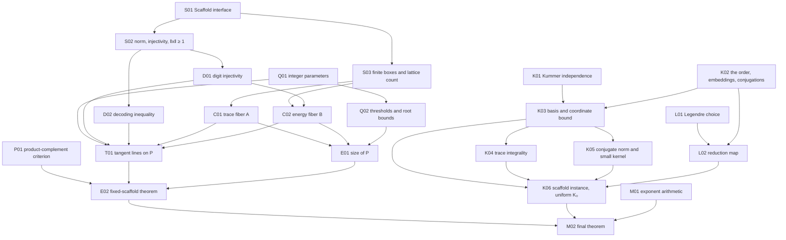

# Lean blueprint: the prime-uniform Nikodym construction (upper bound)

**Planning document; no Lean formalization of this side has been started.** Every node below is a proposed obligation, not a compiled declaration. Nothing is treated as known merely because it appears in the manuscript.

Source proof: `docs/nikodym_construction.tex`, Sections 1, 3, 5 and 7 (Lemma 3.1 "small elements do not vanish", Lemma 3.2 product-complement criterion, Lemma 3.3 mixed digits, Proposition 3.5 decoding, the proof of Theorem 1.1, the proof of Corollary 1.2). Sections 2, 4, 6 and 8 of the manuscript (sketches, the induced-matching theorem, hyperplanes, prime powers) are **not** targets and are partly unfinished in the source; nothing here depends on them.

Target declaration (already stated, `sorry`, in `Nikodym/Main.lean`):

```lean
theorem Nikodym.exists_isNikodym_card_le (hd : 2 ≤ d) {ε : ℝ} (hε : 0 < ε) :
    ∃ q₀ : ℕ, ∀ (F : Type) [Field F] [Fintype F],
      (Fintype.card F).Prime → q₀ ≤ Fintype.card F →
        ∃ N : Finset (Fin d → F), IsNikodym N ∧
          (N.card : ℝ) ≤ (Fintype.card F : ℝ) ^ d -
            (Fintype.card F : ℝ) ^ ((d : ℝ) - 2 ^ (1 - (d : ℝ)) - ε)
```

Mathlib source audit: **5 September 2026**, the `v4.33.0-rc1` checkout in `.lake/packages/mathlib`. Declaration names in Section 6 were located by text search in that checkout; the coding agent should still recheck signatures before use. Nothing here has been tested against a compiler.

## Notation

The manuscript writes $h$ for the ambient dimension and $d$ for the degree of the number field. **`Main.lean` uses `d` for the ambient dimension.** To avoid a clash this document writes

- $h$ for the ambient dimension (Lean `d` in `Main.lean`), $h\ge2$;
- $n$ for the rank of the arithmetic input (the manuscript's $d=[K:\mathbb Q]$), always $n=2^m$;
- $q=|F|$ a prime, $F$ the finite field in the statement;
- $\iota$ a finite index type of "embeddings" and $\kappa$ a finite index type of "basis vectors", both of cardinality $n$.

## 1. Recommended architecture

Split the proof into three layers with a single frozen interface between them.

**Layer A (combinatorial construction over an abstract "scaffold").** All of the manuscript's Section 5 is carried out for a commutative ring $R$ equipped with a $\mathbb Z$-basis, finitely many ring homomorphisms $\sigma_i:R\to\mathbb R$, and a ring homomorphism $\varphi:R\to F$, subject to five elementary axioms (Section 4, node S01). No number fields, no $\mathcal O_K$, no ideals, no Minkowski theory appear in this layer. Its output is: for every prime $q\ge q_0(n,h)$ and every scaffold of rank $n$ with basis bound $K_0$, a product set $P\subseteq F^h$ with a tangent line at every point and

\[
|P|\ \ge\ c(n,h,K_0)\, q^{\,h-2^{1-h}-3h/n}.
\]

**Layer B (the multiquadratic order).** For pairwise coprime squarefree integers $r_1,\dots,r_m>1$, the ring $\mathcal O_r=\mathbb Z[X_1,\dots,X_m]/(X_j^2-r_j)$ with its $2^m$ sign embeddings and, for a prime $q$ in which every $r_j$ is a square, the reduction map $X_j\mapsto s_j$, is a scaffold. The one genuinely number-theoretic input is the $\mathbb Q$-linear independence of $\{\sqrt{r_S}\}_{S\subseteq[m]}$ (node K01). **Do not use `NumberField`, `RingOfIntegers`, `IsDedekindDomain`, `Ideal.absNorm`, or Kummer–Dedekind**; the order $\mathcal O_r$ is free of rank $2^m$ by construction and everything needed about it is elementary once K01 is available.

**Layer C (assembly).** Legendre-symbol choice of $r_j\in\{\ell_j,\ell_j',\ell_j\ell_j'\}$, the finite family of $3^m$ orders, the threshold $q_0$, and the real-exponent bookkeeping. This is the only layer that mentions $\varepsilon$.

The interface between A and B is the `Prop`-valued structure `Scaffold` of node S01. Layer A must be proved against that structure only; Layer B must produce an instance with an **explicit uniform basis bound** $K_0$ over the finite family, because the constant $c(n,h,K_0)$ of Layer A must be uniform over the family before "$q$ sufficiently large" is chosen.

### Core target of Layer A

With $\rho=\frac1{100h\sqrt n}$, $\gamma=\frac1{10}$, $M=\lfloor q^{1/n}\rfloor$, $Q_i=\lfloor q^{1/(n2^i)}\rfloor$ for $1\le i\le h-1$, and $q\ge 2^{n2^{h-1}}$:

\[
\boxed{\;|P|=|A|^{h-1}|B|\ \ge\ c(n,h,K_0)\,q^{\,h-2^{1-h}-3h/n}\;}
\]

where $A$ is a trace fiber of the box $\Lambda_{\gamma M}$ and $B$ an energy fiber of the digit space $\prod_i\Lambda_{\rho Q_i}$. The manuscript's sharper exponent $\kappa_h/d$ with $\kappa_h=3h-5+2^{2-h}$ is **not** tracked; $3h/n$ is all the final theorem needs.

## 2. Changes to the informal proof that make formalization easier

### Replace the number field by an abstract scaffold

The manuscript uses $\mathcal O_K$, its real embeddings, the norm $N_{K/\mathbb Q}$, the ideal $\mathfrak q\mid q$ with $\mathcal O_K/\mathfrak q\cong\mathbb F_q$, and the lattice count $|\Lambda_T|\asymp T^d$. Only five consequences are ever used, and they are the axioms of `Scaffold` (S01): a $\mathbb Z$-basis with bounded embeddings, a coordinate bound (which gives finiteness of boxes and joint injectivity of the embeddings for free), integrality of the trace, and the small-kernel property "$\varphi(x)=0$ and $\prod_i|\sigma_i(x)|<q$ imply $x=0$". Complete splitting of $q$ is never needed: one ring homomorphism $R\to F$ suffices.

### Prove the small-kernel property inside the order, by conjugates

For $x\in\mathcal O_r$ put $\mathrm{nm}(x)=\prod_\varepsilon\tau_\varepsilon(x)$ where $\tau_\varepsilon$ are the sign automorphisms. It is fixed by every $\tau_\delta$, hence lies in $\mathbb Z\cdot1$ (basis coefficients of nonconstant monomials are killed by a sign flip); it lies in $x\mathcal O_r$; and its image under the identity embedding is $\prod_\varepsilon\sigma_\varepsilon(x)$. Then $\varphi(x)=0$ forces $q\mid\mathrm{nm}(x)$ in $\mathbb Z$, and $|\mathrm{nm}(x)|<q$ forces $\mathrm{nm}(x)=0$, so some $\sigma_\varepsilon(x)=0$, so $x=0$ by injectivity of the identity embedding (K01). No `Algebra.norm`, Cayley–Hamilton, or ideal norms.

### Euclidean norm on $\mathbb R^\iota$ instead of AM–GM

Put $\|x\|=\bigl(\sum_i\sigma_i(x)^2\bigr)^{1/2}$, the norm of $(\sigma_i x)_i$ in `EuclideanSpace ℝ ι`. Then $\|x\|^2=\mathrm{Tr}(x^2)$ is a nonnegative integer, so $\|x\|\ge1$ for $x\ne0$; and $\|x\|\le\sqrt n\,\max_i|\sigma_i x|$. These two facts replace the manuscript's $|N(z)|\ge1$, the AM–GM step (3.8), and the norm-based digit lemma. The price is the factor $\sqrt n$ in $\rho$, which only changes constants depending on $n$ and $h$.

### Count lattice points by coefficient boxes, not by Minkowski

If $|\sigma_i(b_k)|\le K_0$ for all basis vectors $b_k$, then $\sum_kc_kb_k\in\Lambda_T$ whenever $|c_k|\le\lfloor T/(nK_0)\rfloor$. Hence $|\Lambda_T|\ge(2\lfloor T/(nK_0)\rfloor+1)^n\ge(T/(nK_0))^n$. Finiteness of $\Lambda_T$ and the reverse inclusion come from the coordinate bound axiom. No covolume, no `IsZLattice`.

### Index by digit vectors; the digit lemma is an injectivity statement

Do not define $Y$ as a set of ring elements with a "unique representation" API. Work with digit vectors $w\in W=\prod_{i=1}^{h-1}\Lambda_{\rho Q_i}$ and the map $b(w)=\sum_iD_iw_i$. Lemma 3.3 becomes "$b$ is injective on $W$" and is proved by induction on the number of radices using $\|\cdot\|\ge1$ (node D01). The energy fiber $B$ is a `Finset` of digit vectors, and the point set is parametrized by $A^{h-1}\times B$.

### Decoding only in the one-variable form

Proposition 3.5 is needed only with $t=1$ and only in the form

\[
x=u+Qw,\ x'=u'+Qw',\ \mathrm{Tr}(x^2)=\mathrm{Tr}(x'^2),\ \mathrm{Tr}(w(x'-x))=0
\ \Longrightarrow\ Q\|w'-w\|\le\|u\|+\|u'\|.
\]

The hypothesis $\mathrm{Tr}(u^2)=\mathrm{Tr}(u'^2)$ mentioned in the manuscript's application is not used by the proof and should not be stated.

### Integer parameters from `Nat.floor` of real roots

Take $M=\lfloor q^{1/n}\rfloor_{\mathbb N}$ and $Q_i=\lfloor q^{1/(n2^i)}\rfloor_{\mathbb N}$. The two inequalities the construction consumes,

\[
(D_iQ_i^2)^n\le q\quad\text{and}\quad D_h^{\,n}\le q,
\]

are exact natural-number consequences of $Q_i^{\,n2^i}\le q$ (node Q01), and they imply $D_iQ_i^2\le M$ and $D_h\le M$. The threshold $q\ge2^{n2^{h-1}}$ gives $Q_i\ge2$ and $Q_i\ge\tfrac12q^{1/(n2^i)}$. Real powers appear only in Q02, E01 and Layer C.

### Only three consequences of the arithmetic are used per point

At a collision $p'\in L_p\cap P$ the argument uses, in order: (i) $\varphi$ injective on $A$ and on $b(W)$; (ii) the small-kernel property once, for $\delta=a_i'-a_i-w_it$; (iii) the decoding inequality. Everything else is bookkeeping of box sizes (node T01). Keep these three as separate lemmas.

## 3. Overview DAG



## 4. Statement catalog

IDs are stable blueprint labels. Module paths are suggested future modules under `Nikodym/Construction/` and `Nikodym/MultiQuadratic/`. Burden describes expected infrastructure, not time. Every node is **planned, not formalized**.

### P01 — Product-complement criterion

**Suggested module:** `Nikodym.Construction.ProductCriterion`. **Burden:** routine. **Depends on:** `Nikodym.Definition`.

**Statement.** Let $h\ge2$, $P_j\subseteq F$ finite for $j<h$, and $P=\prod_jP_j\subseteq F^h$ (`Fintype.piFinset`). Suppose that for every $u\in P$ there is $v_u\ne0$ with $u+tv_u\notin P$ for all $t\ne0$. Then `IsNikodym (Finset.univ \ P)`.

**Proof route.** For $u\in P$ use $v_u$. For $u\notin P$ pick $j$ with $u_j\notin P_j$ and $k\ne j$ (possible as $h\ge2$); the direction `Pi.single k 1` keeps the $j$-th coordinate fixed, so the whole line avoids $P$. Also record `(univ \ P).card = q^h - P.card` via `Finset.card_sdiff` and `Fintype.card_fun`.

### S01 — The scaffold interface

**Suggested module:** `Nikodym.Construction.Scaffold`. **Burden:** routine (definitions only). **Depends on:** mathlib foundations.

**Statement.** For a commutative ring $R$, finite types $\iota,\kappa$, a basis `b : Basis κ ℤ R`, ring homomorphisms `σ : ι → R →+* ℝ`, a field $F$ with `Fintype F`, a ring homomorphism `φ : R →+* F`, and real constants $K_0,K_1$, define the `Prop`-structure `Scaffold b σ φ K₀ K₁` with fields

1. `card_eq : Fintype.card ι = Fintype.card κ`;
2. `basis_bound : ∀ i k, |σ i (b k)| ≤ K₀`;
3. `coord_bound : ∀ x (T : ℝ), (∀ i, |σ i x| ≤ T) → ∀ k, |(b.repr x k : ℝ)| ≤ K₁ * T`;
4. `trace_int : ∀ x, ∃ z : ℤ, ∑ i, σ i x = z`;
5. `small_ker : ∀ x, φ x = 0 → ∏ i, |σ i x| < Fintype.card F → x = 0`.

Also define `box T := {x | ∀ i, |σ i x| ≤ T}` (as a `Set R`), `trace x := ∑ i, σ i x`, and `emb x : EuclideanSpace ℝ ι := (WithLp.equiv 2 _).symm fun i => σ i x`.

**Proof route.** Nothing to prove. Keep all five fields quantifier-explicit; do not bundle $R$ as a field of the structure (instance arguments inside structures are awkward). Write $n$ for `Fintype.card ι`.

### S02 — Norm, joint injectivity, and the unit gap

**Suggested module:** `Nikodym.Construction.Scaffold`. **Burden:** routine. **Depends on:** S01.

**Statement.** Under `Scaffold`: `emb` is an additive group homomorphism; `‖emb x‖ ^ 2 = trace (x ^ 2)`; `‖emb (z • x)‖ = |z| * ‖emb x‖` for `z : ℤ`; if `∀ i, |σ i x| ≤ T` then `‖emb x‖ ≤ √n * T`; `emb` is injective (from `coord_bound` with $T=0$ and `Basis.ext_elem_iff`); and `x ≠ 0 → 1 ≤ ‖emb x‖`.

**Proof route.** `EuclideanSpace.norm_eq` and `map_pow` of the `σ i`. For the unit gap: `trace (x^2)` is an integer by `trace_int`, equals $\sum_i\sigma_i(x)^2\ge0$, and is nonzero by injectivity; an integer $\ge1$ has square root $\ge1$.

### S03 — Finite boxes and the lattice count

**Suggested module:** `Nikodym.Construction.Scaffold`. **Burden:** medium. **Depends on:** S01.

**Statement.** Under `Scaffold`, for every real $T\ge0$: `box T` is finite; write `boxFinset T`. Moreover

\[
\bigl(T/(nK_0)\bigr)^n\ \le\ |\mathrm{box}\,T|\qquad(K_0>0),
\]

and `box T` is closed under negation and `box S + box T ⊆ box (S + T)`.

**Proof route.** Finiteness: `coord_bound` shows `box T` is contained in the image under `b.repr.symm` of the finite set of coefficient vectors with $|c_k|\le\lceil K_1T\rceil$ (`Set.Finite.subset`, `Set.Finite.image`, `Finset.Icc`). Lower bound: the coefficient vectors with $|c_k|\le\lfloor T/(nK_0)\rfloor$ map injectively into `box T` by the triangle inequality and `basis_bound`; there are $(2\lfloor T/(nK_0)\rfloor+1)^n$ of them and $2\lfloor y\rfloor+1\ge y$ for $y\ge0$. Use `Finset.card_le_card_of_injOn` and `Fintype.card_piFinset`.

### D01 — Mixed-radix digit injectivity

**Suggested module:** `Nikodym.Construction.Digits`. **Burden:** medium. **Depends on:** S02.

**Statement.** Under `Scaffold`, let $\theta>0$ with $\theta\sqrt n<1$. For radices $Q:\mathrm{Fin}\,k\to\mathbb N$, all $\ge1$, put $D_0=1$, $D_{i+1}=D_iQ_i$. If $\beta_i\in\mathrm{box}(\theta Q_i)$ for all $i$ and $\sum_iD_i\beta_i=0$ in $R$, then $\beta=0$. Consequently $w\mapsto\sum_iD_iw_i$ is injective on $\prod_i\mathrm{box}(\rho Q_i)$ whenever $2\rho\sqrt n<1$.

**Proof route.** Induction on $k$. Since $Q_0\mid D_i$ for $i\ge1$, $\beta_0=Q_0\cdot\gamma$ with $\gamma=-\sum_{i\ge1}(D_i/Q_0)\beta_i\in R$. If $\gamma\ne0$ then $\|\mathrm{emb}\,\beta_0\|=Q_0\|\mathrm{emb}\,\gamma\|\ge Q_0$ by S02, but $\|\mathrm{emb}\,\beta_0\|\le\sqrt n\,\theta Q_0<Q_0$. So $\gamma=0$, hence $\beta_0=0$ and $\sum_{i\ge1}(D_i/Q_0)\beta_i=0$, which is the statement for the shifted radices `Fin.tail Q`. For the consequence, apply to $\beta_i=w_i-w_i'$ using closure of boxes under differences (S03).

### D02 — Decoding inequality

**Suggested module:** `Nikodym.Construction.Digits`. **Burden:** routine. **Depends on:** S02.

**Statement.** Under `Scaffold`, for $u,u',w,w'\in R$ and $Q\in\mathbb Z$, with $x=u+Qw$ and $x'=u'+Qw'$: if $\mathrm{trace}(x^2)=\mathrm{trace}(x'^2)$ and $\mathrm{trace}(w(x'-x))=0$, then $|Q|\,\|\mathrm{emb}(w'-w)\|\le\|\mathrm{emb}\,u\|+\|\mathrm{emb}\,u'\|$. In particular, if moreover $\|\mathrm{emb}\,u\|+\|\mathrm{emb}\,u'\|<|Q|$, then $w=w'$.

**Proof route.** Put $v=x'-Qw=u'+Q(w'-w)$. Expanding, $\mathrm{trace}(v^2)-\mathrm{trace}(u^2)=\mathrm{trace}(x'^2)-\mathrm{trace}(x^2)-2Q\,\mathrm{trace}(w(x'-x))=0$, so $\|\mathrm{emb}\,v\|=\|\mathrm{emb}\,u\|$ (norms are nonnegative; `Real.sqrt` of equal squares). Then $|Q|\|\mathrm{emb}(w'-w)\|=\|\mathrm{emb}(v-u')\|\le\|\mathrm{emb}\,v\|+\|\mathrm{emb}\,u'\|$ by `norm_sub_le`. The "in particular" uses the unit gap of S02.

### Q01 — Integer parameters and exact power inequalities

**Suggested module:** `Nikodym.Construction.Parameters`. **Burden:** medium. **Depends on:** mathlib foundations.

**Statement.** For $n\ge1$, $h\ge2$, $q\ge1$ define $M=\lfloor q^{1/n}\rfloor_{\mathbb N}$, $Q_i=\lfloor q^{1/(n2^{i})}\rfloor_{\mathbb N}$ for $1\le i\le h-1$, $D_1=1$, $D_{i+1}=D_iQ_i$. Then, as natural-number statements,

\[
M^n\le q,\qquad Q_i^{\,n2^i}\le q,\qquad (D_iQ_i^2)^n\le q,\qquad D_h^{\,n}\le q,\qquad D_{i+1}^{\,n2^i}\le q^{2^i-1},
\]

and hence $D_iQ_i^2\le M$, $D_h\le M$, and $D_j\le D_{i}$ for $j\le i$.

**Proof route.** `Nat.floor_le` and `Real.rpow_natCast` give the first two. For the third, $(D_iQ_i^2)^{n2^i}=\prod_{j<i}(Q_j^{n2^j})^{2^{i-j}}\cdot(Q_i^{n2^i})^2\le q^{(2^i-2)+2}$, then `Nat.pow_le_pow_iff_left`. The fourth and fifth are the same computation with exponent sums $\sum_{j\le i}2^{i-j}=2^{i+1}-1$. An integer whose $n$-th power is $\le q$ is $\le\lfloor q^{1/n}\rfloor$ (`Nat.le_floor_iff'` with `Real.rpow_le_rpow_left_iff`). Keep all of this in `ℕ` except the final floor comparisons.

### Q02 — Thresholds and root lower bounds

**Suggested module:** `Nikodym.Construction.Parameters`. **Burden:** routine. **Depends on:** Q01.

**Statement.** If $q\ge2^{n2^{h-1}}$ then $q^{1/(n2^i)}\ge2$ for $1\le i\le h-1$ and $q^{1/n}\ge2$; consequently $M\ge2$, $Q_i\ge2$, $(M:\mathbb R)\ge\tfrac12q^{1/n}$ and $(Q_i:\mathbb R)\ge\tfrac12q^{1/(n2^i)}$; and $D_{i+1}^2\le q^{2/n}$ as real numbers.

**Proof route.** `Nat.lt_floor_add_one` gives $\lfloor y\rfloor>y-1\ge y/2$ for $y\ge2$. The last inequality is the fifth item of Q01 read in `ℝ` with `Real.rpow_le_rpow_of_exponent_le` and $2^i-1\le 2^i$.

### C01 — The trace fiber

**Suggested module:** `Nikodym.Construction.Fibers`. **Burden:** routine. **Depends on:** S03.

**Statement.** Under `Scaffold` with $K_0>0$, for every real $T\ge1$ there is an integer $s$ and a `Finset` $A\subseteq\mathrm{box}\,T$ with $\mathrm{trace}\,a=s$ for all $a\in A$ and

\[
|A|\ \ge\ \frac{(T/(nK_0))^n}{(2n+1)T}.
\]

**Proof route.** On `box T` the trace is an integer in $[-nT,nT]$, so it takes at most $2nT+1\le(2n+1)T$ values (`Finset.Icc` in `ℤ`, `Int.card_Icc`). Pigeonhole: `Finset.exists_le_card_fiber_of_mul_le_card_of_maps_to`. Then S03 for the size of the box.

### C02 — The energy fiber of the digit space

**Suggested module:** `Nikodym.Construction.Fibers`. **Burden:** medium. **Depends on:** S03, D01, Q01.

**Statement.** Under `Scaffold` with $K_0>0$, $2\rho\sqrt n<1$, $n\rho^2h^2\le1$ and parameters as in Q01: let $W=\prod_{i=1}^{h-1}\mathrm{boxFinset}(\rho Q_i)$ (`Fintype.piFinset`), $y_i(w)=\sum_{j\le i}D_jw_j$, $b(w)=y_{h-1}(w)$, and the color $c(w)=(\mathrm{trace}(y_i(w)^2))_{i}\in\mathbb Z^{h-1}$. Then

- (prefix bound) $y_i(w)\in\mathrm{box}(\rho\,i\,D_{i+1})$ for $w\in W$; in particular $b(w)\in\mathrm{box}(\rho hM)$;
- (colors) $c(w)_i\in[0,D_{i+1}^2]$, so $c$ takes at most $\prod_i(D_{i+1}^2+1)\le2^{h-1}\prod_iD_{i+1}^2$ values;
- there is a color class $B\subseteq W$ with $|B|\ \ge\ |W|\,/\,(2^{h-1}\prod_iD_{i+1}^2)$;
- $b$ is injective on $W$ and $|W|=\prod_i|\mathrm{box}(\rho Q_i)|$.

**Proof route.** Prefix: $|\sigma(y_i)|\le\rho\sum_{j\le i}D_jQ_j=\rho\sum_{j\le i}D_{j+1}\le\rho iD_{i+1}$ since $D$ is monotone (Q01). Colors: $0\le\mathrm{trace}(y_i^2)=\sum\sigma(y_i)^2\le n\rho^2i^2D_{i+1}^2\le D_{i+1}^2$. Pigeonhole as in C01 over the finite color set $\prod_i\mathrm{Icc}\,0\,D_{i+1}^2$. Injectivity is D01 with $\theta=2\rho$.

### T01 — Tangent lines on the product set

**Suggested module:** `Nikodym.Construction.Tangent`. **Burden:** substantial (long but elementary). **Depends on:** S01, S02, D01, D02, Q01, C01, C02.

**Statement.** Under `Scaffold` with the parameters of Q01–Q02, $q\ge2^{n2^{h-1}}$, $\rho=\frac1{100h\sqrt n}$, $\gamma=\frac1{10}$, $A$ from C01 with $T=\gamma M$, and $B$ from C02: for $(a,w)\in A^{h-1}\times B$ define the point

\[
p(a,w)=\bigl(\varphi(a_1),\dots,\varphi(a_{h-1}),\varphi(b(w))\bigr)\in F^h
\]

and the direction $v(w)=(\varphi(w_1),\dots,\varphi(w_{h-1}),1)$. Let $P=\{p(a,w)\}$. Then: $P=\varphi(A)^{h-1}\times\varphi(b(B))$ as a product `Finset`; $p$ is injective; $v(w)\ne0$; and for all $(a,w),(a',w')$ and $\lambda\in F$ with $p(a',w')=p(a,w)+\lambda v(w)$ one has $(a',w')=(a,w)$. Hence $P$ satisfies the hypothesis of P01.

**Proof route.** Three arithmetic sub-lemmas, then the collision argument.

- *(T01a) $\varphi$ is injective on $A$ and on $b(W)$.* Differences lie in $\mathrm{box}(2\gamma M)$ resp. $\mathrm{box}(2\rho hM)$; both radii are $<M$; if $|\sigma_i x|<M$ for all $i$ then $\prod_i|\sigma_ix|<M^n\le q$, so `small_ker` applies. Injectivity of $p$ follows with D01.
- *(T01b) Lifting.* If $\varphi(\delta)=0$ and $\delta\in\mathrm{box}(2\gamma M)+\mathrm{box}(2\rho^2hM)$ then $\delta=0$, because $2\gamma+2\rho^2h<1$.
- *(T01c) Collision.* Suppose $p(a',w')=p(a,w)+\lambda v(w)$. The last coordinate gives $\lambda=\varphi(b(w'))-\varphi(b(w))$. If $w'=w$ then $\lambda=0$, so $\varphi(a_i')=\varphi(a_i)$ and $a'=a$ by T01a. Otherwise let $i$ be the largest index with $w_i'\ne w_i$ (`Finset.max'` on the nonempty set of differing indices) and $t=b(w')-b(w)=y_i(w')-y_i(w)$. Then $\lambda=\varphi(t)$ and coordinate $i$ gives $\delta:=a_i'-a_i-w_it\in\ker\varphi$. Size: $|\sigma(t)|\le2\rho iD_{i+1}$ (prefix bound), $|\sigma(w_it)|\le\rho Q_i\cdot2\rho hD_iQ_i\le2\rho^2hM$ by $D_iQ_i^2\le M$, so T01b gives $a_i'-a_i=w_it$ and, since $\mathrm{trace}(a_i')=\mathrm{trace}(a_i)=s$, $\mathrm{trace}(w_it)=0$. Apply D02 with $u=y_{i-1}(w)$, $u'=y_{i-1}(w')$, $Q=D_i$, $x=y_i(w)$, $x'=y_i(w')$: the energy color gives $\mathrm{trace}(x^2)=\mathrm{trace}(x'^2)$, and $\|\mathrm{emb}\,u\|+\|\mathrm{emb}\,u'\|\le2\sqrt n\,\rho hD_i=D_i/50<D_i$. So $w_i=w_i'$, a contradiction.

Formalize $y_{i-1}$ for $i=1$ as $0$ (empty sum); D02 with $u=u'=0$ is fine. Represent digit vectors as `Fin (h-1) → R` and the point as `Fin.snoc` or `Fin.lastCases` on `Fin h`; fix one convention and never convert.

### E01 — Size of the product set

**Suggested module:** `Nikodym.Construction.Count`. **Burden:** medium. **Depends on:** C01, C02, Q02, S03.

**Statement.** Under the hypotheses of T01 there is an explicit $c=c(n,h,K_0)>0$, independent of $q$ and of the scaffold beyond $K_0$, with

\[
|P|=|A|^{h-1}|B|\ \ge\ c\,q^{\,h-2^{1-h}-3h/n}\qquad(q\ge2^{n2^{h-1}}).
\]

**Proof route.** From S03 and Q02, $|\mathrm{box}(\rho Q_i)|\ge(\rho/(2nK_0))^nq^{2^{-i}}$, so $|W|\ge(\rho/(2nK_0))^{n(h-1)}q^{1-2^{1-h}}$ using $\sum_{i=1}^{h-1}2^{-i}=1-2^{1-h}$ (`Finset.sum_geometric` or a direct induction, in `ℝ`). From C02 and Q02, $|B|\ge|W|\,2^{1-h}q^{-2(h-1)/n}$. From C01 and Q02, $|A|\ge(\gamma/(2nK_0))^n(2n+1)^{-1}2\,q^{1-1/n}$ (use $M\ge\tfrac12q^{1/n}$ and $M\le q^{1/n}$). Multiply and collect exponents: $(h-1)(1-1/n)+1-2^{1-h}-2(h-1)/n=h-2^{1-h}-3(h-1)/n\ge h-2^{1-h}-3h/n$. Use `Real.rpow_add`, `Real.rpow_natCast`, `Real.rpow_le_rpow_of_exponent_le` with $q\ge1$. State $c$ as an explicit closed form so that it is visibly independent of $q$.

### E02 — Fixed-scaffold theorem

**Suggested module:** `Nikodym.Construction.Count`. **Burden:** routine. **Depends on:** P01, T01, E01.

**Statement.** For all $n\ge1$, $h\ge2$, $K_0>0$ there is $c>0$ such that for every prime $q\ge2^{n2^{h-1}}$, every field $F$ with $|F|=q$, and every `Scaffold b σ φ K₀ K₁` of rank $n$ into $F$, there is `N : Finset (Fin h → F)` with `IsNikodym N` and

\[
(q^h-|N|:\mathbb R)\ \ge\ c\,q^{\,h-2^{1-h}-3h/n}.
\]

**Proof route.** $N=\mathrm{univ}\setminus P$ with P01 (hypothesis from T01) and $|N|=q^h-|P|$; then E01.

### K01 — Independence of square roots (Kummer)

**Suggested module:** `Nikodym.MultiQuadratic.Kummer`. **Burden:** substantial. **Depends on:** mathlib foundations.

**Statement.** Let $r:\mathrm{Fin}\,m\to\mathbb N$ with each $r_j>1$ squarefree and $r_j,r_k$ coprime for $j\ne k$. Then the family of real numbers $S\mapsto\sqrt{r_S}$, $r_S=\prod_{j\in S}r_j$, indexed by `Finset (Fin m)`, is `LinearIndependent ℚ`.

**Proof route.** Strengthen to: for every finite list of pairwise coprime squarefree integers $>1$, $\sqrt{r_m}\notin L_{m-1}:=\mathrm{span}_{\mathbb Q}\{\sqrt{r_S}:S\subseteq[m-1]\}$. Induct on $m$ **over all admissible lists**. $L_{m-1}$ is closed under multiplication ($\sqrt{r_S}\sqrt{r_T}=r_{S\cap T}\sqrt{r_{S\triangle T}}$), so it is a finite-dimensional $\mathbb Q$-subalgebra of $\mathbb R$, hence a field (`Subalgebra.isField_of_algebraic`). Write $\sqrt{r_m}=a+b\sqrt{r_{m-1}}$ with $a,b\in L_{m-2}$; squaring and using the inductive hypothesis for $(r_1,\dots,r_{m-1})$ gives $ab=0$. If $b=0$ this contradicts the hypothesis for $(r_1,\dots,r_{m-2},r_m)$; if $a=0$ then $\sqrt{r_{m-1}r_m}=b\,r_{m-1}\in L_{m-2}$ contradicts the hypothesis for $(r_1,\dots,r_{m-2},r_{m-1}r_m)$, which is admissible because a product of coprime squarefree numbers is squarefree (`squarefree_mul_iff`). Base case $m=1$: `irrational_sqrt_natCast_iff` (a squarefree $r>1$ is not a square). Independence over $\mathbb Q$ implies independence over $\mathbb Z$ (`LinearIndependent.restrict_scalars` or clear denominators). This is the only place where irrationality enters the whole construction.

### K02 — The multiquadratic order, its embeddings and conjugations

**Suggested module:** `Nikodym.MultiQuadratic.Order`. **Burden:** medium. **Depends on:** mathlib foundations.

**Statement.** For $r:\mathrm{Fin}\,m\to\mathbb N$ define

\[
\mathcal O_r=\mathbb Z[X_1,\dots,X_m]\big/\bigl(X_j^2-r_j\bigr)_{j},\qquad
\mathrm{mono}\,S=\overline{\textstyle\prod_{j\in S}X_j}\quad(S\subseteq[m]).
\]

For a sign vector $\varepsilon:\mathrm{Fin}\,m\to\mathbb Z^\times$ define ring homomorphisms $\sigma_\varepsilon:\mathcal O_r\to\mathbb R$ by $X_j\mapsto\varepsilon_j\sqrt{r_j}$ and $\tau_\varepsilon:\mathcal O_r\to\mathcal O_r$ by $X_j\mapsto\varepsilon_jX_j$. Prove: $\sigma_\varepsilon(\mathrm{mono}\,S)=\varepsilon_S\sqrt{r_S}$ and $\tau_\varepsilon(\mathrm{mono}\,S)=\varepsilon_S\,\mathrm{mono}\,S$ with $\varepsilon_S=\prod_{j\in S}\varepsilon_j$; $\sigma_\varepsilon=\sigma_{1}\circ\tau_\varepsilon$; $\tau_\varepsilon\circ\tau_\delta=\tau_{\varepsilon\delta}$ and $\tau_1=\mathrm{id}$, so each $\tau_\varepsilon$ is bijective; and every element of $\mathcal O_r$ is a $\mathbb Z$-linear combination of the $\mathrm{mono}\,S$.

**Proof route.** `MvPolynomial (Fin m) ℤ ⧸ Ideal.span (Set.range fun j => X j ^ 2 - C (r j))`; homomorphisms by `Ideal.Quotient.lift` of `MvPolynomial.eval₂Hom`, with the generator check $(\pm\sqrt{r_j})^2=r_j$ (`Real.sq_sqrt`, `Real.sqrt_mul_self`). Equalities of ring homomorphisms out of the quotient by `Ideal.Quotient.ringHom_ext` and `MvPolynomial.ringHom_ext`. Spanning: `MvPolynomial.induction_on` and, for a monomial, strong induction on the total degree using $\overline{X_j^2p}=r_j\overline p$. The alternative tower `AdjoinRoot`/`AdjoinRoot.powerBasis'`/`Basis.smulTower` is viable but makes the $\mathrm{Fin}\,m$-indexed statements awkward; prefer the quotient.

### K03 — Basis and the coordinate bound

**Suggested module:** `Nikodym.MultiQuadratic.Order`. **Burden:** medium. **Depends on:** K01, K02.

**Statement.** Under the hypotheses of K01: $\sigma_1$ is injective; the family $\mathrm{mono}$ is a `Basis (Finset (Fin m)) ℤ 𝓞ᵣ`; and for every $x=\sum_Sc_S\,\mathrm{mono}\,S$ and $T\ge0$, if $|\sigma_\varepsilon(x)|\le T$ for all $\varepsilon$ then $|c_S|\le T$ for all $S$. Also $|\sigma_\varepsilon(\mathrm{mono}\,S)|=\sqrt{r_S}\le\prod_jr_j$.

**Proof route.** Injectivity: $\sigma_1(\sum c_S\mathrm{mono}\,S)=\sum c_S\sqrt{r_S}$ and K01. Basis: `Basis.mk` from independence (pull back K01 along the injective $\sigma_1$) and spanning (K02). Coordinate bound by character orthogonality: $\sum_\varepsilon\varepsilon_S\varepsilon_T=2^m[S=T]$, proved for $S\ne T$ by the involution flipping one coordinate $j\in S\triangle T$ (`Finset.sum_involution`); hence $2^mc_T\sqrt{r_T}=\sum_\varepsilon\varepsilon_T\sigma_\varepsilon(x)$ and $|c_T|\sqrt{r_T}\le T$, with $\sqrt{r_T}\ge1$. Thus $K_1=1$ and $K_0=\prod_jr_j$ work.

### K04 — Trace integrality

**Suggested module:** `Nikodym.MultiQuadratic.Order`. **Burden:** routine. **Depends on:** K03.

**Statement.** $\sum_\varepsilon\sigma_\varepsilon(x)=2^m\,c_\varnothing(x)\in\mathbb Z$ for every $x\in\mathcal O_r$.

**Proof route.** The case $T=\varnothing$ of the orthogonality relation in K03.

### K05 — Conjugate norm and the small-kernel property

**Suggested module:** `Nikodym.MultiQuadratic.Order`. **Burden:** medium. **Depends on:** K02, K03.

**Statement.** Put $\mathrm{nm}(x)=\prod_\varepsilon\tau_\varepsilon(x)\in\mathcal O_r$. Then $\tau_\delta(\mathrm{nm}\,x)=\mathrm{nm}\,x$ for all $\delta$; there is $N(x)\in\mathbb Z$ with $\mathrm{nm}(x)=N(x)\cdot1$; $N(x)=\prod_\varepsilon\sigma_\varepsilon(x)$; and $\mathrm{nm}(x)\in x\,\mathcal O_r$. Consequently, for any ring homomorphism $\varphi:\mathcal O_r\to F$ into a field of prime cardinality $q$: if $\varphi(x)=0$ and $\prod_\varepsilon|\sigma_\varepsilon(x)|<q$ then $x=0$.

**Proof route.** Invariance by reindexing the product along $\varepsilon\mapsto\delta\varepsilon$ (`Fintype.prod_equiv`). An invariant element has $c_S\delta_S=c_S$ for all $\delta$; for $S\ne\varnothing$ choose $\delta$ with $\delta_S=-1$, so $c_S=0$, leaving $c_\varnothing\cdot1$. Apply $\sigma_1$ and K02 for the product formula. Factor out $\varepsilon=1$ (`Finset.mul_prod_erase`). For the consequence: $\varphi(\mathrm{nm}\,x)=0$ gives $(N(x):F)=0$, hence $q\mid N(x)$ by `CharP.intCast_eq_zero_iff` (the characteristic of $F$ is $q$ since $|F|=q$ is prime); with $|N(x)|<q$ this forces $N(x)=0$ (`Int.eq_zero_of_abs_lt_dvd`), so $\sigma_\varepsilon(x)=0$ for some $\varepsilon$, so $\sigma_1(\tau_\varepsilon x)=0$, so $\tau_\varepsilon x=0$ (K03), so $x=0$ (K02).

### L01 — Legendre choice among $\ell,\ell',\ell\ell'$

**Suggested module:** `Nikodym.MultiQuadratic.Legendre`. **Burden:** routine. **Depends on:** mathlib foundations.

**Statement.** Let $F$ be a finite field of odd prime cardinality $q$, and $\ell\ne\ell'$ primes with $\ell,\ell'<q$. Then at least one of $(\ell:F)$, $(\ell':F)$, $(\ell\ell':F)$ is a nonzero square in $F$.

**Proof route.** $(\ell:F)\ne0$ because $\mathrm{char}\,F=q\nmid\ell$ (`CharP.cast_eq_zero_iff`, `Nat.Prime.eq_one_or_self_of_dvd`). `quadraticChar F` is multiplicative (`MulChar.map_mul`) and takes values $\pm1$ on nonzero elements; `quadraticChar_one_iff_isSquare` and `quadraticChar_neg_one_iff_not_isSquare` convert. If both $\ell$ and $\ell'$ have character $-1$, their product has character $1$. Requires `ringChar F ≠ 2`, i.e. $q$ odd.

### L02 — The reduction map

**Suggested module:** `Nikodym.MultiQuadratic.Legendre`. **Burden:** routine. **Depends on:** K02, L01.

**Statement.** If $s:\mathrm{Fin}\,m\to F$ satisfies $s_j^2=(r_j:F)$ for all $j$, then $X_j\mapsto s_j$ induces a ring homomorphism $\varphi_{r,s}:\mathcal O_r\to F$.

**Proof route.** `Ideal.Quotient.lift` of `MvPolynomial.eval₂Hom (Int.castRingHom F) s`; the generators map to $s_j^2-r_j=0$.

### K06 — Scaffold instance with a uniform basis bound

**Suggested module:** `Nikodym.MultiQuadratic.Scaffold`. **Burden:** routine. **Depends on:** K03, K04, K05, L02.

**Statement.** Under the hypotheses of K01 and L02, with $F$ of prime cardinality, the data $(\mathrm{mono},\ \sigma,\ \varphi_{r,s})$ form a `Scaffold` with $\iota=\mathrm{Fin}\,m\to\mathbb Z^\times$, $\kappa=\mathrm{Finset}\,(\mathrm{Fin}\,m)$, $K_0=\prod_jr_j$ and $K_1=1$. Moreover if $r_j\mid\ell_j\ell_j'$ for all $j$ then $K_0\le\Pi:=\prod_j\ell_j\ell_j'$, and the scaffold with the constant $\Pi$ in place of $K_0$ is also valid.

**Proof route.** `card_eq`: both cardinalities are $2^m$ (`Fintype.card_fun`, `Fintype.card_finset`, `Int.units_card` or `Fintype.card_units_int`). The other fields are K03, K04, K05. `basis_bound` is monotone in $K_0$.

### M01 — Exponent arithmetic

**Suggested module:** `Nikodym.Construction.Main`. **Burden:** routine. **Depends on:** mathlib foundations.

**Statement.** (a) For $h\ge1$ and $\varepsilon>0$ there is $m$ with $3h/2^m\le\varepsilon/2$. (b) For $c>0$ and $\varepsilon>0$ there is $q_1$ such that $q^{-\varepsilon/2}\le c$ for all real $q\ge q_1$. (c) If $c\,q^{\,\alpha-3h/n}\ge\ldots$ — concretely: if $3h/n\le\varepsilon/2$, $q\ge1$ and $c\ge q^{-\varepsilon/2}$, then $c\,q^{\,h-2^{1-h}-3h/n}\ge q^{\,h-2^{1-h}-\varepsilon}$. (d) There exist $2m$ distinct odd primes: $\ell_j=\mathrm{nth\ Prime}(2j+1)$, $\ell_j'=\mathrm{nth\ Prime}(2j+2)$.

**Proof route.** (a) `Nat.lt_two_pow_self` or `exists_pow_lt_of_lt_one` after dividing. (b) $q\ge c^{-2/\varepsilon}$ and `Real.rpow_le_rpow_left_iff`, `Real.rpow_natCast`, `Real.rpow_neg`. (c) `Real.rpow_add` and `Real.rpow_le_rpow_of_exponent_le`. (d) `Nat.nth` with `Nat.nth_strictMono` and `Nat.infinite_setOf_prime`; index $0$ is the prime $2$, so start at index $1$ to stay odd; alternatively iterate `Nat.exists_infinite_primes`.

### M02 — The final theorem

**Suggested module:** `Nikodym.Construction.Main` (the `sorry` in `Nikodym/Main.lean` is discharged by this). **Burden:** medium. **Depends on:** E02, K06, L01, M01.

**Statement.** `Nikodym.exists_isNikodym_card_le` as displayed at the top of this document.

**Proof route.** Given $h\ge2$ and $\varepsilon>0$: choose $m$ by M01(a), $n=2^m$, primes $\ell_j,\ell_j'$ by M01(d), $\Pi=\prod\ell_j\ell_j'$, and $c=c(n,h,\Pi)$ from E02. Put $q_0=\max\bigl(2^{n2^{h-1}},\ \Pi+1,\ q_1\bigr)$ with $q_1$ from M01(b). For a field $F$ of prime cardinality $q\ge q_0$: $q$ is odd and exceeds every $\ell_j,\ell_j'$, so L01 chooses $r_j\in\{\ell_j,\ell_j',\ell_j\ell_j'\}$ and $s_j$ with $s_j^2=r_j$ (`IsSquare` unfolds to this). The $r_j$ are pairwise coprime, squarefree and $>1$ (distinct primes, `Nat.Coprime` of products of disjoint primes, `squarefree_mul_iff`). K06 gives a scaffold with constant $\Pi$; E02 gives $N$ with $q^h-|N|\ge c\,q^{h-2^{1-h}-3h/n}$; M01(c) converts to $q^{h-2^{1-h}-\varepsilon}$. Read the conclusion in `ℝ` with `Nat.cast_sub` (justified by `Finset.card_le_univ`) and `Real.rpow_natCast`.

## 5. Exact arithmetic used in the collision argument

All radii below are for the sup-box $\mathrm{box}(T)=\{x:\forall i,\ |\sigma_ix|\le T\}$; the Euclidean norm satisfies $\|\mathrm{emb}\,x\|\le\sqrt n\,T$ on it. Constants: $\rho=\frac1{100h\sqrt n}$, $\gamma=\frac1{10}$; so $2\rho\sqrt n=\frac1{50h}$, $n\rho^2h^2=10^{-4}$.

| Quantity | Box radius | Needed inequality |
| --- | --- | --- |
| $a-a'$, $a,a'\in A$ | $2\gamma M$ | $2\gamma<1$ |
| $b(w)-b(w')$, $w,w'\in W$ | $2\rho(h-1)D_h\le2\rho hM$ | $2\rho h<1$ |
| $\beta_i=w_i-w_i'$ in D01 | $2\rho Q_i$ | $\sqrt n\cdot2\rho<1$ |
| $t=y_i(w')-y_i(w)$ | $2\rho iD_{i+1}$ | — |
| $w_it$ | $2\rho^2hD_iQ_i^2\le2\rho^2hM$ | uses $D_iQ_i^2\le M$ |
| $\delta=a_i'-a_i-w_it$ | $(2\gamma+2\rho^2h)M$ | $2\gamma+2\rho^2h<1$ |
| $u=y_{i-1}(w)$, $u'$ | $\rho(i-1)D_i\le\rho hD_i$ | $2\sqrt n\,\rho h<1$ (decoding) |

Small kernel is always invoked through: $|\sigma_ix|<M$ for all $i$ $\Rightarrow$ $\prod_i|\sigma_ix|<M^n\le q$.

Counting, with $C_0=\rho/(2nK_0)$ and $C_1=\gamma/(2nK_0)$:

\[
|W|\ge C_0^{\,n(h-1)}q^{1-2^{1-h}},\qquad
|B|\ge|W|\,2^{1-h}q^{-2(h-1)/n},\qquad
|A|\ge\frac{2\,C_1^{\,n}}{2n+1}\,q^{1-1/n},
\]

\[
|P|=|A|^{h-1}|B|\ \ge\ \underbrace{\Bigl(\tfrac{2C_1^n}{2n+1}\Bigr)^{h-1}C_0^{\,n(h-1)}2^{1-h}}_{c(n,h,K_0)}\ q^{\,h-2^{1-h}-3(h-1)/n}.
\]

## 6. Mathlib coverage and source audit

Verified by text search in the pinned checkout; signatures must be rechecked at implementation time.

| Ingredient | Verified declarations | Assessment |
| --- | --- | --- |
| Irrationality of $\sqrt r$ | `irrational_sqrt_natCast_iff`, `Nat.Prime.irrational_sqrt` (`Mathlib/NumberTheory/Real/Irrational.lean`) | Base case of K01. |
| Squarefree products | `squarefree_mul_iff` (`Mathlib/Algebra/Squarefree/Basic.lean`) | Admissibility of $r_{m-1}r_m$ and of $\ell\ell'$ in K01, M02. |
| Finite-dimensional domain is a field | `Subalgebra.isField_of_algebraic` (`Mathlib/RingTheory/Algebraic/Basic.lean`) | Makes $L_{m-1}$ a field in K01; needs the span shown to be a subalgebra. |
| Quotient rings and evaluation | `Ideal.Quotient.lift`, `Ideal.Quotient.ringHom_ext`, `MvPolynomial.eval₂Hom`, `MvPolynomial.ringHom_ext`, `MvPolynomial.induction_on` | K02, L02. |
| Alternative order construction | `AdjoinRoot.powerBasis'`, `AdjoinRoot.lift`, `Basis.smulTower` (`Mathlib/RingTheory/AdjoinRoot.lean`, `Mathlib/RingTheory/AlgebraTower.lean`) | Only if the quotient route proves awkward. |
| Bases | `Basis.mk`, `Basis.repr`, `Basis.ext_elem_iff` | K03, S02, S03. |
| Pigeonhole | `Finset.exists_le_card_fiber_of_mul_le_card_of_maps_to`, `Finset.exists_lt_card_fiber_of_mul_lt_card_of_maps_to` (`Mathlib/Combinatorics/Pigeonhole.lean`) | C01, C02. |
| Products of finsets | `Fintype.piFinset`, `Fintype.card_piFinset` | P01, C02, S03. |
| Euclidean norm | `EuclideanSpace.norm_eq`, `norm_add_le`, `norm_sub_le` (`Mathlib/Analysis/InnerProductSpace/PiL2.lean`) | S02, D02. |
| Sign-flip involutions | `Finset.sum_involution` (additive version of `Finset.prod_involution`, `Mathlib/Algebra/BigOperators/Group/Finset/Basic.lean`) | Character orthogonality in K03–K05. |
| Quadratic characters | `quadraticChar`, `quadraticChar_one_iff_isSquare`, `quadraticChar_neg_one_iff_not_isSquare`, `quadraticCharFun_mul` / `MulChar.map_mul` (`Mathlib/NumberTheory/LegendreSymbol/QuadraticChar/Basic.lean`) | L01. |
| Prime-cardinality fields | `ZMod.ringEquivOfPrime` (`Mathlib/Data/ZMod/Basic.lean`), `CharP.cast_eq_zero_iff`, `CharP.intCast_eq_zero_iff` | Characteristic of $F$ in K05, L01; check how `CharP F q` is obtained from `Fintype.card F = q` (via `ringChar` and `FiniteField.card'`). |
| Infinitely many primes | `Nat.exists_infinite_primes` (`Mathlib/Data/Nat/Prime/Infinite.lean`), `Nat.nth` | M01(d). |
| Floors and real powers | `Nat.floor_le`, `Nat.lt_floor_add_one`, `Nat.le_floor_iff'`, `Real.rpow_natCast`, `Real.rpow_le_rpow_left_iff`, `Real.rpow_le_rpow_of_exponent_le`, `Real.rpow_add` | Q01, Q02, E01, M01. |
| Square roots | `Real.sq_sqrt`, `Real.sqrt_mul_self`, `Real.sqrt_le_sqrt` | K02, S02. |
| Determinants (not needed) | `Matrix.exists_mulVec_eq_zero_iff`, `LinearMap.aeval_self_charpoly`, `Algebra.norm_eq_prod_automorphisms` | Listed only to record that the conjugate-norm route of K05 avoids them. |
| Not to be used | `NumberField`, `NumberField.RingOfIntegers`, `IsDedekindDomain`, `Ideal.absNorm`, `IsZLattice`, `NumberField.mixedEmbedding` | The scaffold axioms replace all of this. |

Also verified by name: `Int.eq_zero_of_abs_lt_dvd` (`Mathlib/Algebra/Order/Group/Unbundled/Int.lean`), `Nat.nth_strictMono` and `Nat.nth_strictMonoOn` (`Mathlib/Data/Nat/Nth.lean`), `Nat.infinite_setOf_prime` (`Mathlib/Data/Nat/PrimeFin.lean`), `Fintype.card_units_int`, `LinearIndependent.restrict_scalars`, `Real.rpow_neg`. **Not** located and to be found or proved: a lemma giving `CharP F (Fintype.card F)` for a field of prime cardinality (route: `CharP F (ringChar F)`, `FiniteField.card' : ∃ p n, p.Prime ∧ Fintype.card F = p ^ n` with `ringChar F = p`, and `Nat.Prime.eq_one_of_pow` style reasoning to get `n = 1`).

## 7. Suggested coding-agent work packages

1. **Freeze the interface:** S01 exactly as displayed, then P01 and S02–S03. This can be done immediately and independently of everything else.
2. **Arithmetic track:** Q01, Q02, M01. Pure `ℕ`/`ℝ` bookkeeping with no dependence on the scaffold; a good parallel task.
3. **Digit track:** D01, D02, C01, C02. Depends only on S01–S03.
4. **Collision track:** T01, E01, E02. The longest single proof is T01c; write T01a and T01b as separate lemmas first and state T01c with the maximal differing index as an explicit hypothesis before assembling.
5. **Kummer:** K01 as a standalone file about real numbers, with the strengthened induction hypothesis over all admissible lists.
6. **Order track:** K02–K06, L01, L02. K02 and L02 need no number theory and can start at once; K03–K05 wait for K01.
7. **Assembly:** M02, replacing the `sorry` in `Nikodym/Main.lean`.

Review milestones: (i) `Scaffold` typechecks and P01, S02, S03 compile; (ii) E02 compiles against the interface; (iii) K06 compiles; (iv) `#print axioms Nikodym.exists_isNikodym_card_le` shows no `sorryAx`.

## 8. Statement audit and common failure modes

- **The target is Corollary 1.2 only.** Theorem 1.1 (fixed field, exponent $\kappa_h/d$), Theorem 1.3 (induced matchings), and the prime-power section are not formalization targets, and the last two are incomplete in the source.
- **The Lean statement quantifies over fields of prime cardinality, not over `ZMod q`.** Every use of quadratic reciprocity-type facts must go through `quadraticChar F` on the abstract field, or transport along `ZMod.ringEquivOfPrime`. Do not restate the theorem for `ZMod`.
- **Only one prime above $q$ is needed.** "Splits completely" in the manuscript is never used beyond the existence of one ring homomorphism $R\to F$. Do not formalize splitting.
- **Do not build the ring of integers.** The order $\mathbb Z[\sqrt{r_1},\dots,\sqrt{r_m}]$ suffices; the small-kernel property is proved by conjugates (K05), not by ideal norms.
- **Kummer independence is unavoidable and isolated.** Injectivity of the identity embedding, hence the domain property of $\mathcal O_r$, hence "$N(x)=0\Rightarrow x=0$", all rest on K01. Joint injectivity of all embeddings together would follow from orthogonality alone, but the small-kernel proof needs the single embedding $\sigma_1$ to be injective.
- **The induction in K01 must range over all admissible lists**, since it modifies the list ($r_{m-1}r_m$). Stating it for one fixed list will not close.
- **Boxes are sup-norm boxes; the decoding lemma uses the Euclidean norm.** The conversion factor $\sqrt n$ is why $\rho$ contains $\sqrt n$. Do not drop it.
- **Uniformity of constants.** $c$ in E02 may depend on $n,h,K_0$ only. The family of $3^m$ orders has $K_0\le\Pi$ uniformly; this must be threaded through K06 before $q_0$ is chosen in M02.
- **Natural subtraction.** $q^h-|N|$ is a true difference because $|N|\le q^h$; supply `Finset.card_le_univ` before `Nat.cast_sub`.
- **Real powers of $q$.** `Real.rpow` with negative exponents appears in $q^{-\varepsilon/2}$ and $q^{-2(h-1)/n}$; keep $q\ge1$ hypotheses explicit for `rpow_le_rpow_of_exponent_le`.
- **The empty prefix.** $y_0=0$; D02 with $u=u'=0$ handles the case $i=1$ without special treatment, provided the sum over an empty range is used rather than a separate definition.
- **No status inflation.** Every node here is planned. Nothing should be marked as done until the corresponding declaration compiles without `sorry`.
